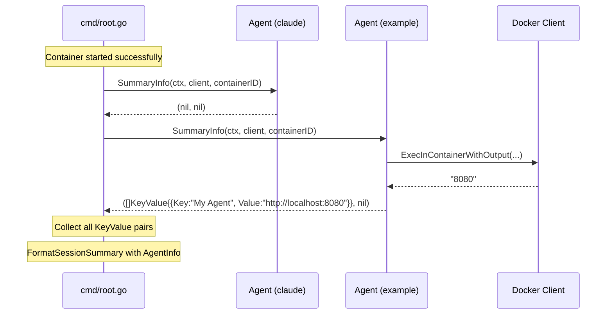

# Design: Agent Summary Info

> **Related documents:**
> - [design.md](design.md) — Overview and document index
> - [requirements-agent-summary-info.md](requirements-agent-summary-info.md) — Requirements (SI-1 through SI-7)
> - [design-components.md](design-components.md) — Core component designs (Agent Interface, SessionSummary)

---

## Overview

This design describes the Agent Summary Info mechanism — an extension to the `Agent` interface that allows agent modules to contribute key:value pairs to the session summary printed after a successful container start. The mechanism enforces the architectural rule that "core has zero knowledge of agents."

The design:
1. Adds a `KeyValue` struct and `SummaryInfo` method to the `Agent` interface
2. Makes the core iterate generically over agents to collect summary info
3. Removes all agent-specific references from `root.go`

---

## Architecture



The core treats all agents uniformly — it never inspects the returned keys or values, never branches on agent IDs, and never references any agent-specific constant.

---

## Components and Interfaces

### KeyValue Type

Defined in `internal/agent/agent.go`:

```go
// KeyValue represents a single labelled line in the session summary.
// Agents return slices of these from SummaryInfo().
type KeyValue struct {
    Key   string
    Value string
}
```

**Design decisions:**
- Lives in the `agent` package alongside the `Agent` interface so that both the core and agent modules can reference it without import cycles.
- Two simple exported fields — no methods, no validation. The core formats them as-is.

### Updated Agent Interface

```go
type Agent interface {
    ID() string
    Install(b *docker.DockerfileBuilder)
    CredentialStorePath() string
    ContainerMountPath(homeDir string) string
    HasCredentials(storePath string) (bool, error)
    HealthCheck(ctx context.Context, c *docker.Client, containerID string) error
    SummaryInfo(ctx context.Context, c *docker.Client, containerID string) ([]KeyValue, error)
}
```

The `SummaryInfo` method receives the same parameters as `HealthCheck` — this is intentional so agents can inspect the running container (exec commands, read logs, etc.) to gather information.

### Updated SessionSummary

In `internal/cmd/root.go`:

```go
type SessionSummary struct {
    DataDir       string
    ProjectDir    string
    SSHPort       int
    SSHConnect    string
    EnabledAgents []string
    AgentInfo     []agent.KeyValue // generic agent info pairs
}
```

### Updated FormatSessionSummary

```go
func FormatSessionSummary(s SessionSummary) string {
    var sb strings.Builder
    fmt.Fprintf(&sb, "Data directory:  %s\n", s.DataDir)
    fmt.Fprintf(&sb, "Project directory: %s\n", s.ProjectDir)
    fmt.Fprintf(&sb, "SSH port:        %d\n", s.SSHPort)
    fmt.Fprintf(&sb, "SSH connect:     %s\n", s.SSHConnect)
    fmt.Fprintf(&sb, "Enabled agents:  %s\n", strings.Join(s.EnabledAgents, ", "))
    for _, kv := range s.AgentInfo {
        fmt.Fprintf(&sb, "%-17s%s\n", kv.Key+":", kv.Value)
    }
    return sb.String()
}
```

**Design decisions:**
- The format string `"%-17s%s\n"` left-pads the key (with colon) to 17 characters, aligning values with the existing fields (`"Data directory:  "` is 17 chars including the trailing spaces).
- No conditional logic — the loop handles zero, one, or many entries uniformly.
- When `AgentInfo` is nil or empty, the loop body never executes, producing output identical to the standard five-field format.

---

### Core Collection Logic

In `runStart` (and the reconnect path), after health checks pass and before calling `printSessionSummary`:

```go
// Collect agent summary info.
var agentInfo []agent.KeyValue
for _, a := range enabledAgents {
    kvs, err := a.SummaryInfo(ctx, c, containerName)
    if err != nil {
        fmt.Fprintf(os.Stderr, "warning: %s summary info: %v\n", a.ID(), err)
        continue
    }
    agentInfo = append(agentInfo, kvs...)
}
```

**Design decisions:**
- Iteration order matches the declared order of `enabledAgents` (which comes from the `--agents` flag parsing order).
- On error: print a warning to stderr, skip that agent's contributions, continue with the next agent.
- On nil/empty return: `append(agentInfo, nil...)` is a no-op in Go — no special case needed.
- The collected `agentInfo` slice is passed to `printSessionSummary` and stored in `SessionSummary.AgentInfo`.

### Updated printSessionSummary

```go
func printSessionSummary(dd *datadir.DataDir, projectDir string, containerName string, sshPort int, agentIDs []string, agentInfo []agent.KeyValue) {
    summary := SessionSummary{
        DataDir:       dd.Path(),
        ProjectDir:    projectDir,
        SSHPort:       sshPort,
        SSHConnect:    "ssh " + containerName,
        EnabledAgents: agentIDs,
        AgentInfo:     agentInfo,
    }
    fmt.Print(FormatSessionSummary(summary))
}
```

The previous agent-specific URL parameter is removed and replaced by the generic `agentInfo []agent.KeyValue`.

---

## Other Agents: No-Op SummaryInfo

Claude Code, Augment Code, and Build Resources all implement the method identically:

```go
// SummaryInfo returns nil — this agent has no summary information to contribute.
func (a *claudeAgent) SummaryInfo(ctx context.Context, c *docker.Client, containerID string) ([]agent.KeyValue, error) {
    return nil, nil
}
```

```go
func (a *augmentAgent) SummaryInfo(ctx context.Context, c *docker.Client, containerID string) ([]agent.KeyValue, error) {
    return nil, nil
}
```

```go
func (a *buildResourcesAgent) SummaryInfo(ctx context.Context, c *docker.Client, containerID string) ([]agent.KeyValue, error) {
    return nil, nil
}
```

---

## Data Models

### KeyValue (new)

| Field | Type | Description |
|---|---|---|
| `Key` | `string` | Label for the summary line (e.g. `"My Agent"`) |
| `Value` | `string` | Content for the summary line (e.g. `"http://localhost:8080"`) |

### SessionSummary (updated)

| Field | Type | Change |
|---|---|---|
| `DataDir` | `string` | unchanged |
| `ProjectDir` | `string` | unchanged |
| `SSHPort` | `int` | unchanged |
| `SSHConnect` | `string` | unchanged |
| `EnabledAgents` | `[]string` | unchanged |
| `AgentInfo` | `[]agent.KeyValue` | **added** |

---

## Correctness Properties

*A property is a characteristic or behavior that should hold true across all valid executions of a system — essentially, a formal statement about what the system should do. Properties serve as the bridge between human-readable specifications and machine-verifiable correctness guarantees.*

### Property 1: Collection preserves order and excludes errors

*For any* ordered list of agents where each agent returns either a `([]KeyValue, nil)` or `(nil, error)`, the collected output SHALL contain exactly the KeyValue pairs from non-erroring agents, in the same order as the agents were declared, with per-agent ordering preserved, and zero contributions from erroring agents.

**Validates: Requirements SI-2.2, SI-3.2, SI-3.3**

### Property 2: Session summary formatting includes all agent info after standard fields

*For any* `SessionSummary` with a non-empty `AgentInfo` slice, `FormatSessionSummary` SHALL produce output where: (a) every `KeyValue.Key` and `KeyValue.Value` appears in the output, (b) all agent info lines appear after the "Enabled agents" line, and (c) when `AgentInfo` is nil or empty, no extra lines appear beyond the standard five fields.

**Validates: Requirements SI-2.3, SI-2.4, SI-7.2, SI-7.3, SI-7.4**

---

## Error Handling

| Scenario | Behaviour |
|---|---|
| Agent's `SummaryInfo()` returns `(nil, error)` | Warning printed to stderr: `"warning: <agent-id> summary info: <error>\n"`. No KeyValue pairs from that agent. Startup continues. |
| Agent's `SummaryInfo()` returns `(nil, nil)` | No lines added. No warning. |
| Agent's `SummaryInfo()` returns `([]KeyValue{}, nil)` | Same as nil — no lines added. |
| Context cancelled during `SummaryInfo()` | Agent returns `ctx.Err()`. Core prints warning, continues with remaining agents. |
| Agent port/resource discovery times out | Returns error. Core prints warning. Session summary omits that agent's info. Startup succeeds. |

---

## Testing Strategy

### Property-Based Tests (using `pgregory.net/rapid`)

| Property | What to generate | What to assert |
|---|---|---|
| Property 1: Collection order | Random slices of `([]KeyValue, error)` tuples | Collected output matches expected filtered/ordered result |
| Property 2: Formatting | Random `SessionSummary` with random `AgentInfo` | All keys/values present, after "Enabled agents", no extras when empty |

Each property test runs minimum 100 iterations. Tag format:
```go
// Feature: agent-summary-info, Property 1: Collection preserves order and excludes errors
```

### Unit Tests (example-based)

| Test | What it verifies |
|---|---|
| `TestFormatSessionSummaryNoAgentInfo` | Output matches current format when `AgentInfo` is nil |
| `TestFormatSessionSummaryWithAgentInfo` | Output includes agent lines after "Enabled agents" |
| `TestCollectSummaryInfoSkipsErrors` | Warning printed, erroring agent excluded, others included |
| `TestClaudeSummaryInfoReturnsNil` | `(nil, nil)` returned |
| `TestAugmentSummaryInfoReturnsNil` | `(nil, nil)` returned |
| `TestBuildResourcesSummaryInfoReturnsNil` | `(nil, nil)` returned |

### Integration Tests

| Test | What it verifies |
|---|---|
| `TestAgentSummaryInfoDiscoversInfo` | With a running container, `SummaryInfo()` returns the correct info |
| `TestSessionSummaryContainsAgentInfo` | Full start flow prints agent info via the generic mechanism |

### What is NOT tested with PBT

- The actual port discovery logic (requires a running container with `ss` — integration test territory)
- The timeout/retry behaviour (time-dependent, tested with unit tests using short timeouts)
- Structural requirements (interface method exists, field removed) — enforced by the Go compiler
