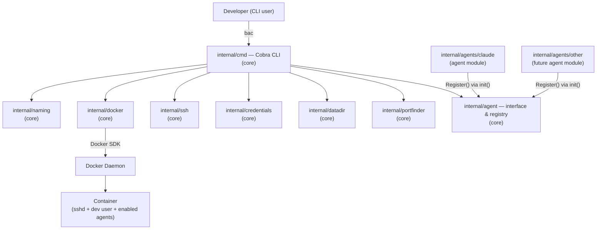
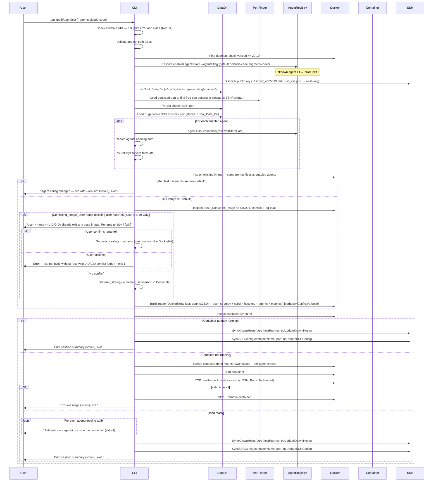
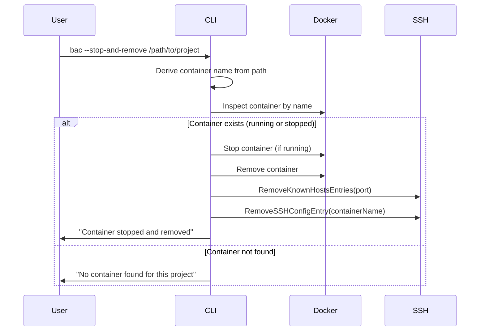
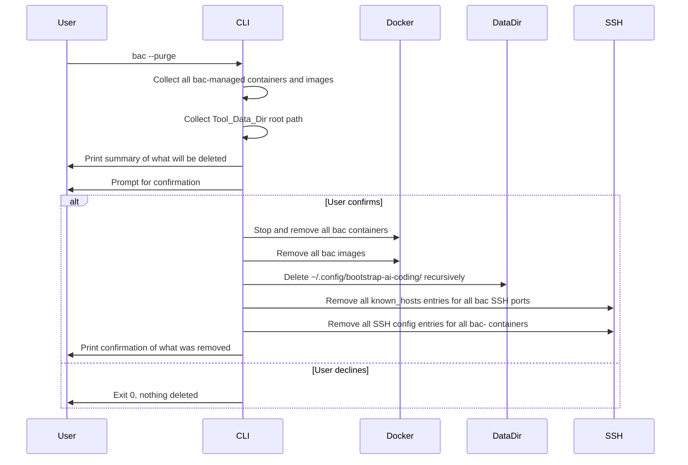

# Part 1 — Core Application Design

## Architecture

### High-Level Component Diagram



The core packages (`internal/cmd`, `internal/naming`, `internal/docker`, `internal/ssh`, `internal/credentials`, `internal/datadir`, `internal/portfinder`, `internal/agent`) have **no import dependency** on any package under `internal/agents/`. Agent modules are wired in exclusively via `main.go` blank imports.

### Package Layout

```
bootstrap-ai-coding/
├── main.go                  # Blank-imports agent modules; wires everything together
│
└── internal/
    │   ── CORE ─────────────────────────────────────────────────────────────
    ├── constants/
    │   └── constants.go         # All glossary-derived constants — single source of truth
    ├── cmd/
    │   └── root.go              # Cobra root command, flag definitions, orchestration
    ├── naming/
    │   └── naming.go            # Deterministic container name from project path
    ├── docker/
    │   ├── client.go            # Docker SDK client wrapper; prerequisite checks (daemon reachable, version >= constants.MinDockerVersion)
    │   ├── builder.go           # DockerfileBuilder — dynamic Dockerfile assembly
    │   └── runner.go            # Container create/start/stop/inspect helpers
    ├── ssh/
    │   ├── keys.go              # Public key discovery
    │   ├── known_hosts.go       # ~/.ssh/known_hosts sync (SyncKnownHosts, RemoveKnownHostsEntries)
    │   └── ssh_config.go        # ~/.ssh/config sync (SyncSSHConfig, RemoveSSHConfigEntry, RemoveAllBACSSHConfigEntries)
    ├── credentials/
    │   └── store.go             # Credential store path resolution, dir creation, token check
    ├── datadir/
    │   └── datadir.go           # Tool_Data_Dir management: create, read/write port, keys, manifest, purge
    ├── portfinder/
    │   └── portfinder.go        # SSH port auto-selection: start at constants.SSHPortStart, increment until free
    ├── agent/
    │   ├── agent.go             # Agent interface definition  ← stable API boundary
    │   └── registry.go          # AgentRegistry — Register/Lookup/All
    │
    │   ── AGENT MODULES ────────────────────────────────────────────────────
    └── agents/
        └── claude/
            └── claude.go        # Claude Code — reference Agent implementation
        # future agents added here, no core files change
```

### Startup Sequence



### Stop Sequence



### Purge Sequence



---

## Core Components and Interfaces

### Constants Package — Single Source of Truth

`constants/constants.go` holds every value that originates from the requirements glossary. No other package may hardcode these values — they must always import and reference this package.

```go
package constants

const (
    BaseContainerImage          = "ubuntu:26.04"
    ContainerUser               = "dev"
    ContainerUserHome           = "/home/" + ContainerUser
    WorkspaceMountPath          = "/workspace"
    SSHPortStart                = 2222
    ToolDataDirRoot             = "~/.config/bootstrap-ai-coding"
    ContainerNamePrefix         = "bac-"
    ContainerNameParentSep      = "_"   // separator between <parentdir> and <dirname>
    ContainerNameCounterSep     = "-"   // separator before the numeric counter suffix
    ManifestFilePath            = "/bac-manifest.json"
    ClaudeCodeAgentName          = "claude-code"
    AugmentCodeAgentName         = "augment-code"
    DefaultAgents               = ClaudeCodeAgentName + "," + AugmentCodeAgentName
    SSHHostKeyType              = "ed25519"
    MinDockerVersion            = "20.10"
    ContainerSSHPort            = 22
    ToolDataDirPerm             = 0o700
    ToolDataFilePerm            = 0o600
    SSHDirPerm                  = 0o700
    KnownHostsFile              = "~/.ssh/known_hosts"
    SSHConfigFile               = "~/.ssh/config"
    ImageBuildTimeout           = 5 * time.Minute  // Image_Build_Timeout glossary term
)
```

**Validates: All glossary-derived values across Req 1–19, CC-1–CC-6**

---

### Agent Interface — The Core API Boundary

The `Agent` interface is the **stable contract** between the core and all agent modules. It lives in `agent/agent.go`. The core never imports any `agents/*` package directly.

```go
package agent

import (
    "context"
    "github.com/koudis/bootstrap-ai-coding/internal/docker"
)

type Agent interface {
    ID() string
    Install(b *docker.DockerfileBuilder)
    CredentialStorePath() string
    ContainerMountPath() string
    HasCredentials(storePath string) (bool, error)
    HealthCheck(ctx context.Context, containerID string) error
}
```

**Validates: Req 7.1**

### AgentRegistry

The registry is a package-level map in `agent/registry.go`. Agent modules self-register in their `init()` functions.

```go
func Register(a Agent)                  // panics on duplicate ID
func Lookup(id string) (Agent, error)   // descriptive error listing known IDs when not found
func All() []Agent
func KnownIDs() []string                // sorted alphabetically
```

Agent modules are wired into the binary exclusively via blank imports in `main.go`:

```go
import (
    _ "github.com/koudis/bootstrap-ai-coding/internal/agents/claude"
    // Add future agents here — no other file changes required
)
```

**Validates: Req 7.2**

---

### DockerfileBuilder

`docker/builder.go` assembles a Dockerfile incrementally. The base layer (`ubuntu:26.04` + Container_User setup + sshd + SSH host key injection) is always present. Each enabled agent appends its own `RUN` steps via `Install()`. A manifest `COPY` step is added last.

The builder supports two **user strategies** (Req 10, 10a):
- `UserStrategyCreate` — no UID/GID conflict; creates the Container_User with `useradd`
- `UserStrategyRename` — a Conflicting_Image_User exists; renames it with `usermod -l` instead

```go
type UserStrategy int

const (
    UserStrategyCreate UserStrategy = iota
    UserStrategyRename
)

func NewDockerfileBuilder(uid, gid int, publicKey, hostKeyPriv, hostKeyPub string,
    strategy UserStrategy, conflictingUser string) *DockerfileBuilder

func (b *DockerfileBuilder) From(image string)
func (b *DockerfileBuilder) Run(cmd string)
func (b *DockerfileBuilder) Env(k, v string)
func (b *DockerfileBuilder) Copy(src, dst string)
func (b *DockerfileBuilder) Cmd(cmd string)
func (b *DockerfileBuilder) Build() string
func (b *DockerfileBuilder) Lines() []string
```

### Base Image User Inspection

`docker/client.go` exposes a helper to detect UID/GID conflicts in the base image before building (Req 10a):

```go
type ImageUser struct {
    Username string
    UID      int
    GID      int
}

// FindConflictingUser runs docker run --rm on the base image, parses /etc/passwd,
// and returns the first user whose UID or GID matches. Returns (nil, nil) if no conflict.
func FindConflictingUser(ctx context.Context, client *Client, uid, gid int) (*ImageUser, error)
```

**Validates: Req 9.1–9.3, Req 10.1–10.5, Req 10a.4, Req 13.2**

---

### Docker Image Build — Verbose Mode

`docker/runner.go` exposes `BuildImage` and `BuildImageWithTimeout`. Both accept a `verbose bool` parameter that controls how the Docker daemon's build response stream is handled.

The Docker SDK's `client.ImageBuild` returns an `io.ReadCloser` whose body is a sequence of newline-delimited JSON objects, each with a `stream` field (progress text) and optionally an `error` field.

**Silent mode (`verbose == false`, default):**
The stream is drained in a background goroutine. Each decoded `stream` value is accumulated in a `strings.Builder` for error reporting only. No output is written to stdout. The "Building image..." message (Req 14.5) is the only visible indication that a build is in progress.

**Verbose mode (`verbose == true`):**
Each decoded `stream` value is written to `os.Stdout` immediately as it arrives, producing real-time layer-by-layer progress and `RUN` step output. Error detection and timeout handling are identical to silent mode.

```go
// BuildImage builds a Docker image from the spec's Dockerfile.
// When verbose is true, build output is streamed to os.Stdout in real time.
func BuildImage(ctx context.Context, c *Client, spec ContainerSpec, verbose bool) (string, error)

// BuildImageWithTimeout is the underlying implementation used by BuildImage.
func BuildImageWithTimeout(ctx context.Context, c *Client, spec ContainerSpec, timeout time.Duration, verbose bool) (string, error)
```

The `verbose` flag is threaded from `Config.Verbose` → `runStart` → `BuildImage`. It is never consulted when no build is triggered (manifest matches and `--rebuild` is absent).

**Validates: Req 20.2, 20.3, 20.4, 20.6**

---

### Naming Package

`naming/naming.go` derives a human-readable, collision-resistant container name from the absolute project path. The algorithm follows Req 5.1:

1. Extract the directory name (last path component) and parent directory name (second-to-last). If at the filesystem root, use `"root"` as the parent.
2. Sanitize each component: lowercase; replace chars outside `[a-z0-9.-]` with `-`; collapse consecutive `-`; trim leading/trailing `-`. The `_` character is reserved as the separator and is excluded from the allowed set.
3. Try candidates in order, checking only against existing `bac-`-prefixed containers supplied by the caller:
   - `bac-<dirname>`
   - `bac-<parentdir>_<dirname>`
   - `bac-<parentdir>_<dirname>-2`, `-3`, … (incrementing until free)
4. Return the first free candidate.

```go
// ContainerName returns the first candidate name not present in existingNames.
// existingNames should contain only bac-prefixed container names already on the host.
func ContainerName(projectPath string, existingNames []string) (string, error)

// SanitizeNameComponent lowercases s and replaces any char outside [a-z0-9.-] with '-',
// collapses consecutive '-', and trims leading/trailing '-'.
func SanitizeNameComponent(s string) string
```

**Validates: Req 5.1**

---

### SSH Key Discovery

`ssh/keys.go` implements public key resolution: `--ssh-key` flag > `~/.ssh/id_ed25519.pub` > `~/.ssh/id_rsa.pub`.

```go
func DiscoverPublicKey(sshKeyFlag string) (string, error)
func GenerateHostKeyPair() (priv, pub string, err error)
```

**Validates: Req 4.1, 4.4**

---

### SSH known_hosts Management

`ssh/known_hosts.go` keeps `~/.ssh/known_hosts` in sync with the container's SSH host key (Req 18). Called after the container is confirmed ready and after `--stop-and-remove` / `--purge`.

```go
// SyncKnownHosts ensures correct entries for the given port and host public key.
// If noUpdate is true, prints a notice and returns without touching the file.
func SyncKnownHosts(port int, hostPubKey string, noUpdate bool) error

// RemoveKnownHostsEntries removes all lines matching the given port. No-op if file absent.
func RemoveKnownHostsEntries(port int) error
```

Both functions guarantee they never modify lines that do not match the target port patterns.

**Validates: Req 18.1–18.9**

---

### SSH Config Management

`ssh/ssh_config.go` maintains a `Host` stanza in `~/.ssh/config` for each container (Req 19). The entry lets the user connect with `ssh bac-<dirname>` without specifying port, user, or hostname.

**Why `IdentityFile` is omitted:** The container already has the user's public key in `authorized_keys` (Req 4), and the host key is kept consistent in `known_hosts` (Req 18). SSH authenticates and verifies correctly without an explicit key path in the config entry.

```go
type SSHConfigEntry struct {
    Host     string // e.g. "bac-my-project" or "bac-path_my-project"
    HostName string // always "localhost"
    Port     int    // SSH_Port
    User     string // constants.ContainerUser ("dev")
    // StrictHostKeyChecking: always "yes" — host key kept consistent by Req 18
    // IdentityFile: intentionally omitted — public key in authorized_keys (Req 4)
}

// SyncSSHConfig ensures a correct entry exists for containerName and port.
// If noUpdate is true, prints a notice and returns without touching the file.
// Appends if absent; no-op if matching; replaces and prints confirmation if stale.
// Never modifies entries whose Host does not match containerName.
func SyncSSHConfig(containerName string, port int, noUpdate bool) error

// RemoveSSHConfigEntry removes the Host stanza for containerName. No-op if absent.
func RemoveSSHConfigEntry(containerName string) error

// RemoveAllBACSSHConfigEntries removes all stanzas whose Host starts with
// constants.ContainerNamePrefix. Called by --purge. No-op if file absent.
func RemoveAllBACSSHConfigEntries() error
```

**Parsing strategy:** `~/.ssh/config` is read line-by-line. A stanza begins at a `Host <name>` line and ends at the next `Host` line or EOF. The tool identifies its own stanzas by matching the `Host` value against `constants.ContainerNamePrefix`. All other stanzas are preserved verbatim.

**Validates: Req 19.1–19.9**

---

### Credentials Package

`credentials/store.go` handles per-agent credential store path resolution and directory creation. It is agent-agnostic — it operates on paths provided by the agent via the `Agent` interface.

```go
// Resolve returns override if non-empty, else expands ~ in agentDefault.
func Resolve(agentDefault, override string) string

// EnsureDir creates the directory at path if it does not already exist.
func EnsureDir(path string) error
```

**Validates: Req 8.3, 8.4**

---

### DataDir Package

`datadir/datadir.go` manages the Tool_Data_Dir (`~/.config/bootstrap-ai-coding/<container-name>/`). Single source of truth for all persistent per-project data: SSH port, SSH host key pair, and agent manifest.

```go
func New(containerName string) (*DataDir, error)
func (d *DataDir) Path() string
func (d *DataDir) ReadPort() (int, error)
func (d *DataDir) WritePort(port int) error
func (d *DataDir) ReadHostKey() (priv, pub string, err error)
func (d *DataDir) WriteHostKey(priv, pub string) error
func (d *DataDir) ReadManifest() ([]string, error)
func (d *DataDir) WriteManifest(agentIDs []string) error
func PurgeRoot() error
```

**Validates: Req 12.2, 13.1, 13.4, 15.1–15.3**

---

### PortFinder Package

`portfinder/portfinder.go` implements SSH port auto-selection starting at `constants.SSHPortStart`, incrementing until a free port is found.

```go
func FindFreePort() (int, error)
func IsPortFree(port int) bool
```

**Validates: Req 12.1**

---

## Core Data Models

### Mode

```go
type Mode int

const (
    ModeStart Mode = iota // ¬S ∧ ¬U — start or reconnect
    ModeStop              // S ∧ ¬U  — stop and remove
    ModePurge             // U ∧ ¬S  — remove all tool data
)

func ResolveMode(stopAndRemove, purge bool) (Mode, error)
```

### Config

```go
type Config struct {
    Mode               Mode
    ProjectPath        string
    EnabledAgents      []string
    SSHKeyPath         string
    SSHPort            int    // 0 = auto-select
    Rebuild            bool
    Verbose            bool
    NoUpdateKnownHosts bool
    NoUpdateSSHConfig  bool
    CredStoreOverrides map[string]string
}
```

### ContainerSpec

```go
type ContainerSpec struct {
    Name        string
    ImageTag    string
    Dockerfile  string
    Mounts      []Mount
    SSHPort     int
    Labels      map[string]string
    HostUID     int
    HostGID     int
}

type Mount struct {
    HostPath      string
    ContainerPath string
    ReadOnly      bool
}
```

### SessionSummary

```go
type SessionSummary struct {
    DataDir       string
    ProjectDir    string
    SSHPort       int
    SSHConnect    string   // e.g. "ssh bac-my-project" (relies on SSH_Config_Entry from Req 19)
    EnabledAgents []string
}
```

---

## Core Error Handling

### CLI Flag Combination Errors (validated before all other checks)

| Condition | Requirement | Behaviour |
|---|---|---|
| `--stop-and-remove` and `--purge` both set | CLI-1 | Descriptive error → stderr, exit 1 |
| START or STOP mode and `<project-path>` absent | CLI-2 | Usage message → stderr, exit 1 |
| PURGE mode and `<project-path>` provided | CLI-2 | Descriptive error → stderr, exit 1 |
| STOP or PURGE mode and any of `--agents`, `--port`, `--ssh-key`, `--rebuild`, `--no-update-known-hosts`, `--no-update-ssh-config`, `--verbose` set | CLI-3 | Descriptive error naming the incompatible flag(s) → stderr, exit 1 |
| `--port` value outside 1024–65535 | CLI-5 | Descriptive error → stderr, exit 1 |
| `--agents` parses to empty list | CLI-6 | Descriptive error → stderr, exit 1 |
| `--agents` contains unknown agent ID | CLI-6 | Unknown ID + available IDs → stderr, exit 1 |

### Runtime Errors

| Failure Condition | Detection Point | Behaviour |
|---|---|---|
| CLI invoked as root (UID 0) | After flag validation | "Running as root is not permitted" → stderr, exit 1 |
| Project path missing | After flag validation | Descriptive error → stderr, exit 1 |
| No SSH public key found | SSH key discovery | Descriptive error → stderr, exit 1 |
| Docker daemon unreachable | Docker prerequisite check | "Start Docker" message → stderr, exit 1 |
| Docker version < `constants.MinDockerVersion` | Docker prerequisite check | Detected + required version → stderr, exit 1 |
| Duplicate agent registration | `agent.Register()` at startup | Panic (programming error, caught immediately) |
| Conflicting_Image_User found, user declines rename | UID/GID conflict check | "Cannot build without resolving UID/GID conflict" → stderr, exit 1 |
| Agent manifest mismatch | Image inspect on startup | "Run with --rebuild" message → stdout, exit 0 |
| Image build failure | Docker build | Build log → stderr, exit 1 |
| Image build timeout (`constants.ImageBuildTimeout`) | Docker build | Timeout error → stderr, exit 1 |
| Container start failure | Docker start | Stop container, error → stderr, exit 1 |
| SSH health check timeout | Post-start TCP poll | Stop container, error → stderr, exit 1 |
| Persisted port in use by another process | Port check before start | Port conflict message → stderr, exit 1 |
| `--stop-and-remove`, container not found | Docker inspect | Informational message → stdout, exit 0 |
| Container already running | Docker inspect before create | Session summary → stdout, exit 0 |
| `--purge` user declines confirmation | Confirmation prompt | Exit 0, nothing deleted |
