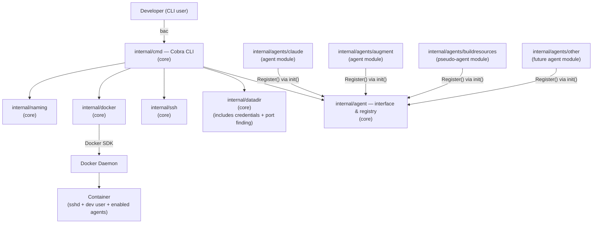
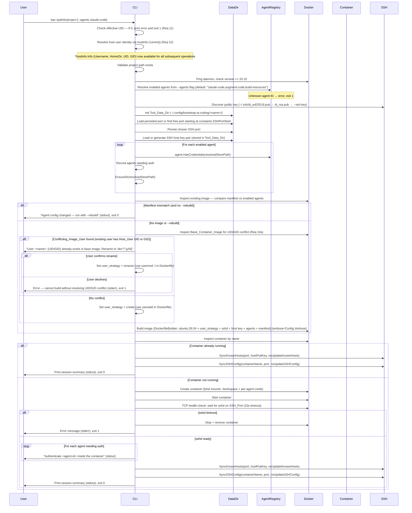
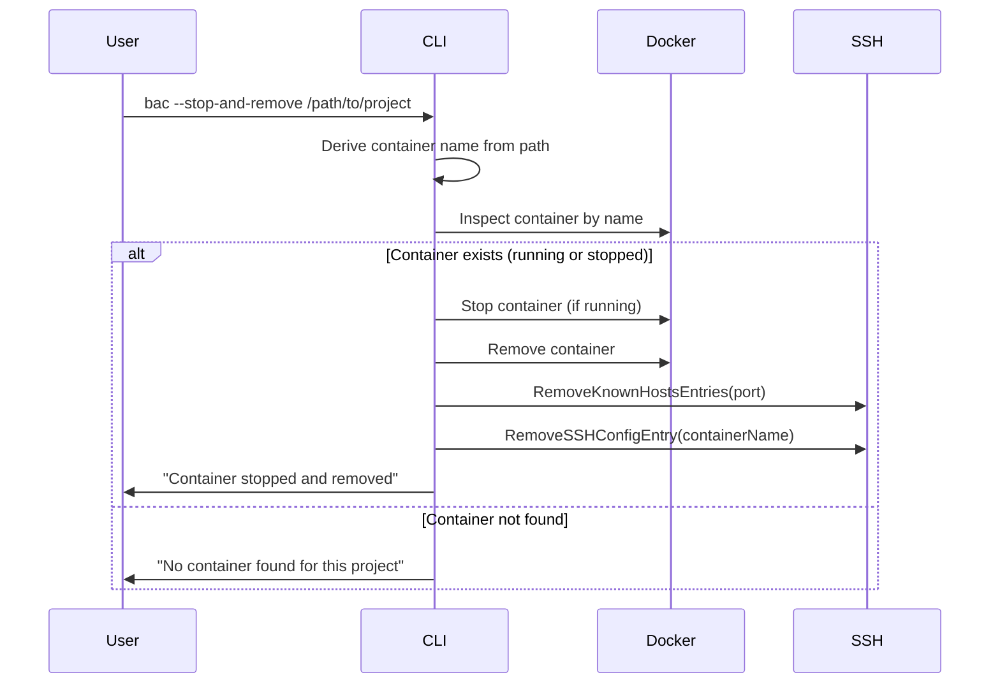
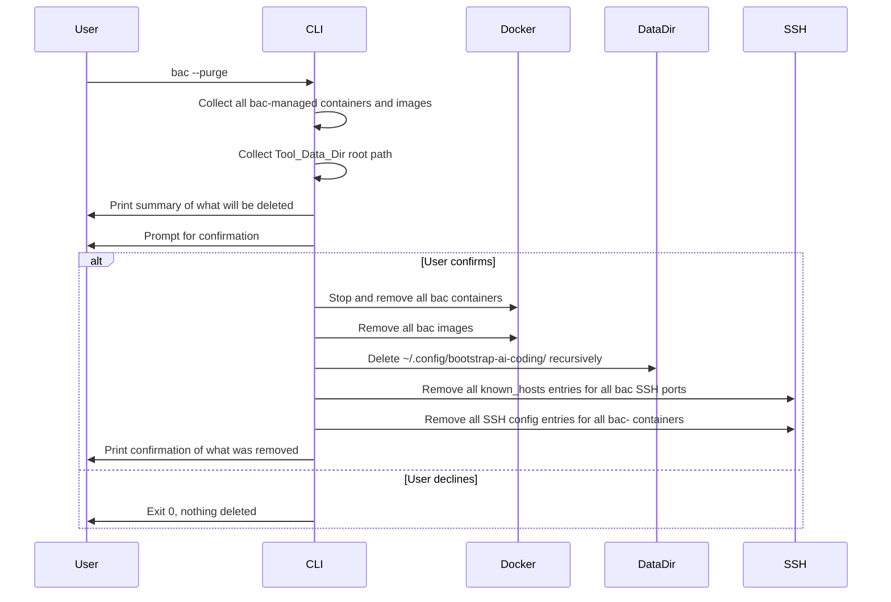

# Part 1 — Core Application Design

## Architecture

### High-Level Component Diagram



The core packages (`internal/cmd`, `internal/naming`, `internal/docker`, `internal/ssh`, `internal/datadir`, `internal/agent`) have **no import dependency** on any package under `internal/agents/`. Agent modules are wired in exclusively via `main.go` blank imports.

> **Note (Req 28 — Module Consolidation):** The former `internal/credentials` and `internal/portfinder` packages have been merged into `internal/datadir`. Both dealt with per-project persistent state (credential paths, port selection/persistence) and had only `cmd/root.go` as their consumer. Consolidating them reduces package count without introducing import cycles or mixing unrelated concerns.

### Package Layout

```
bootstrap-ai-coding/
├── main.go                  # Blank-imports agent modules; wires everything together
│
└── internal/
    │   ── CORE ─────────────────────────────────────────────────────────────
    ├── constants/
    │   └── constants.go         # All glossary-derived constants — single source of truth
    ├── hostinfo/
    │   └── hostinfo.go          # Info struct + Current() — runtime host user identity (Req 22)
    ├── cmd/
    │   └── root.go              # Cobra root command, flag definitions, orchestration
    ├── naming/
    │   └── naming.go            # Deterministic container name from project path
    ├── docker/
    │   ├── client.go            # Docker SDK client wrapper; prerequisite checks (daemon reachable, version >= constants.MinDockerVersion)
    │   ├── builder.go           # DockerfileBuilder — dynamic Dockerfile assembly
    │   └── runner.go            # Container create/start/stop/inspect helpers
    ├── ssh/
    │   ├── keys.go              # Public key discovery
    │   ├── known_hosts.go       # ~/.ssh/known_hosts sync (SyncKnownHosts, RemoveKnownHostsEntries)
    │   └── ssh_config.go        # ~/.ssh/config sync (SyncSSHConfig, RemoveSSHConfigEntry, RemoveAllBACSSHConfigEntries)
    ├── datadir/
    │   ├── datadir.go           # Tool_Data_Dir management: create, read/write port, keys, manifest, purge
    │   ├── credentials.go       # Credential store path resolution and dir creation (merged from credentials/)
    │   └── portfinder.go        # SSH port auto-selection starting at constants.SSHPortStart (merged from portfinder/)
    ├── agent/
    │   ├── agent.go             # Agent interface definition  ← stable API boundary
    │   ├── preparer.go          # CredentialPreparer optional interface
    │   └── registry.go          # AgentRegistry — Register/Lookup/All
    │
    │   ── AGENT MODULES ────────────────────────────────────────────────────
    └── agents/
        ├── claude/
        │   └── claude.go        # Claude Code — reference Agent implementation
        ├── augment/
        │   └── augment.go       # Augment Code agent module
        └── buildresources/
            └── buildresources.go # Build Resources — pseudo-agent for dev toolchains
        # future agents added here, no core files change
```

### Startup Sequence



### Stop Sequence



### Purge Sequence



---

## Core Components and Interfaces

### Constants Package — Single Source of Truth

`constants/constants.go` holds every value that originates from the requirements glossary. No other package may hardcode these values — they must always import and reference this package.

> **Note (Req 22):** `ContainerUser` and `ContainerUserHome` are **no longer compile-time constants**. They have been removed from this package. The container user's username and home directory are resolved at runtime from the host user's OS account via the `hostinfo` package (see below). All packages that previously referenced `constants.ContainerUser` or `constants.ContainerUserHome` now receive these values at runtime through the `*hostinfo.Info` struct.

```go
package constants

const (
    BaseContainerImage          = "ubuntu:26.04"
    // ContainerUser — REMOVED (Req 22): now a runtime value from Info.Username
    // ContainerUserHome — REMOVED (Req 22): now a runtime value from Info.HomeDir
    WorkspaceMountPath          = "/workspace"
    SSHPortStart                = 2222
    ToolDataDirRoot             = "~/.config/bootstrap-ai-coding"
    ContainerNamePrefix         = "bac-"
    ContainerNameParentSep      = "_"   // separator between <parentdir> and <dirname>
    ContainerNameCounterSep     = "-"   // separator before the numeric counter suffix
    ManifestFilePath            = "/bac-manifest.json"
    ClaudeCodeAgentName          = "claude-code"
    AugmentCodeAgentName         = "augment-code"
    BuildResourcesAgentName      = "build-resources"
    DefaultAgents               = ClaudeCodeAgentName + "," + AugmentCodeAgentName + "," + BuildResourcesAgentName
    SSHHostKeyType              = "ed25519"
    MinDockerVersion            = "20.10"
    ContainerSSHPort            = 22
    ToolDataDirPerm             = 0o700
    ToolDataFilePerm            = 0o600
    SSHDirPerm                  = 0o700
    KnownHostsFile              = "~/.ssh/known_hosts"
    SSHConfigFile               = "~/.ssh/config"
    ImageBuildTimeout           = 8 * time.Minute  // Image_Build_Timeout glossary term
    GitConfigPerm               = 0o444            // Host_Git_Config permissions inside container (Req 24)
)
```

**Validates: All glossary-derived values across Req 1–21, CC-1–CC-6**

---

### HostInfo Package — Runtime Container User Identity (Req 22)

New package `internal/hostinfo` resolves the host user's identity at runtime. This replaces the former compile-time constants `ContainerUser` and `ContainerUserHome`. The struct is named `Info` and is passed as a single value to all components that need it (DockerfileBuilder, agent modules, SSH config, etc.).

```go
// Package hostinfo resolves the host user's identity at CLI startup.
package hostinfo

import (
    "fmt"
    "os/user"
    "strconv"
)

// Info holds the runtime-resolved host user identity.
// These values determine the Container_User username and home directory.
type Info struct {
    Username string // host username (e.g. "alice")
    HomeDir  string // host home directory (e.g. "/home/alice")
    UID      int    // host effective UID
    GID      int    // host effective GID
}

// Current returns the host user's identity. Called once at CLI startup.
// Returns an error if the OS user cannot be determined.
func Current() (*Info, error) {
    u, err := user.Current()
    if err != nil {
        return nil, fmt.Errorf("resolving host user: %w", err)
    }
    uid, _ := strconv.Atoi(u.Uid)
    gid, _ := strconv.Atoi(u.Gid)
    return &Info{
        Username: u.Username,
        HomeDir:  u.HomeDir,
        UID:      uid,
        GID:      gid,
    }, nil
}
```

**Design decisions:**

- **Single resolution point:** `hostinfo.Current()` is called once in `cmd/root.go` at the very start of the `RunE` function, before flag validation (but after the root-check). The resulting `*hostinfo.Info` is threaded through to all dependent operations.
- **No global state:** The `Info` struct is passed explicitly — no package-level `var` that could be read before initialization.
- **Linux-only:** No macOS path translation. The `HomeDir` from `os/user.Current()` is used as-is (always `/home/<username>`).
- **UID/GID included:** The struct also carries UID and GID, consolidating the existing `os.Getuid()`/`os.Getgid()` calls that were scattered across `cmd/root.go`.

**Validates: Req 22.1, 22.2, 22.3, 22.5, 22.6**

---

### Agent Interface — The Core API Boundary

The `Agent` interface is the **stable contract** between the core and all agent modules. It lives in `agent/agent.go`. The core never imports any `agents/*` package directly.

**Req 22 change:** `ContainerMountPath()` now accepts the container user's home directory as a parameter, since it is no longer available as a compile-time constant. This allows agent modules to construct their mount paths using the runtime-resolved home directory from `hostinfo.Info.HomeDir`.

```go
package agent

import (
    "context"
    "github.com/koudis/bootstrap-ai-coding/internal/docker"
)

type Agent interface {
    ID() string
    Install(b *docker.DockerfileBuilder)
    CredentialStorePath() string
    ContainerMountPath(homeDir string) string  // Req 22: homeDir from info.HomeDir
    HasCredentials(storePath string) (bool, error)
    HealthCheck(ctx context.Context, c *docker.Client, containerID string) error
}
```

**Validates: Req 7.1, Req 22.4**

### AgentRegistry

The registry is a package-level map in `agent/registry.go`. Agent modules self-register in their `init()` functions.

```go
func Register(a Agent)                  // panics on duplicate ID
func Lookup(id string) (Agent, error)   // descriptive error listing known IDs when not found
func All() []Agent
func KnownIDs() []string                // sorted alphabetically
```

Agent modules are wired into the binary exclusively via blank imports in `main.go`:

```go
import (
    _ "github.com/koudis/bootstrap-ai-coding/internal/agents/claude"
    _ "github.com/koudis/bootstrap-ai-coding/internal/agents/augment"
    _ "github.com/koudis/bootstrap-ai-coding/internal/agents/buildresources"
    // Add future agents here — no other file changes required
)
```

**Validates: Req 7.2**

---

### DockerfileBuilder

`docker/builder.go` assembles a Dockerfile incrementally. The base layer (`ubuntu:26.04` + Container_User setup + sshd + SSH host key injection) is always present. Each enabled agent appends its own `RUN` steps via `Install()`. A manifest `COPY` step is added last.

The builder supports two **user strategies** (Req 10, 10a):
- `UserStrategyCreate` — no UID/GID conflict; creates the Container_User with `useradd`
- `UserStrategyRename` — a Conflicting_Image_User exists; renames it with `usermod -l` instead

**Req 22 change:** The constructor now accepts a `*hostinfo.Info` struct (runtime-resolved from the host user's OS account) instead of separate `uid, gid int` parameters or compile-time constants. All Dockerfile instructions that reference the container user or home directory use the fields from this struct. Callers pass the single `*hostinfo.Info` value rather than individual arguments.

```go
type UserStrategy int

const (
    UserStrategyCreate UserStrategy = iota
    UserStrategyRename
)

// NewDockerfileBuilder creates a builder for the container Dockerfile.
// info carries the runtime-resolved Container_User identity (Req 22).
func NewDockerfileBuilder(info *hostinfo.Info,
    publicKey, hostKeyPriv, hostKeyPub string,
    strategy UserStrategy, conflictingUser string) *DockerfileBuilder

func (b *DockerfileBuilder) From(image string)
func (b *DockerfileBuilder) Run(cmd string)
func (b *DockerfileBuilder) Env(k, v string)
func (b *DockerfileBuilder) Copy(src, dst string)
func (b *DockerfileBuilder) Cmd(cmd string)
func (b *DockerfileBuilder) Finalize()        // appends CMD — must be called last, after all agent Install() steps
func (b *DockerfileBuilder) Build() string
func (b *DockerfileBuilder) Lines() []string
// Username returns the container username from the *hostinfo.Info this builder was configured with (Req 22).
func (b *DockerfileBuilder) Username() string
// HomeDir returns the container user home directory from the *hostinfo.Info this builder was configured with (Req 22).
func (b *DockerfileBuilder) HomeDir() string
```

**Generated Dockerfile user creation example** (values from `*hostinfo.Info`):
```
RUN useradd --create-home --home-dir /home/alice --uid 1000 --gid 1000 --shell /bin/bash alice
```
(Where `alice`, `/home/alice`, `1000`, `1000` are example values from `info.Username`, `info.HomeDir`, `info.UID`, `info.GID`.)

**Dockerfile instruction order (Req 21):** `NewDockerfileBuilder` seeds the base layers (FROM, openssh-server, Container_User, sudo, SSH keys, sshd_config, /run/sshd) but does **not** append `CMD`. The caller appends agent steps via `Install()`, then the manifest `RUN`, then calls `Finalize()` to append `CMD` as the final instruction. This ensures all `RUN` layers are ordered before `CMD`, keeping them in Docker's layer cache across rebuilds.

```
FROM ubuntu:26.04
RUN apt-get install openssh-server sudo     ← base, stable, cached
RUN groupadd/useradd <username> (or usermod rename)  ← stable per project, cached (Req 22: from info.Username)
RUN sudoers for <username>                  ← stable, cached
RUN SSH authorized_keys in <homeDir>/.ssh/  ← stable per user key, cached (Req 22: from info.HomeDir)
RUN SSH host key injection                  ← stable per project, cached
RUN sshd_config hardening                   ← stable, cached
RUN mkdir /run/sshd                         ← stable, cached
RUN apt-get install dbus-x11 gnome-keyring libsecret-1-0  ← keyring (CC-7), cached
RUN install /etc/profile.d/dbus-keyring.sh  ← keyring startup script, cached
RUN printf gitconfig > <homeDir>/.gitconfig ← git config (Req 24), base64-encoded RUN (not COPY — keeps Dockerfile self-contained); skipped if absent on host
RUN apt-get install curl ca-certificates    ← agent step, cached after first build
RUN nodesource setup + nodejs               ← agent step, cached after first build
RUN npm install -g @augmentcode/auggie      ← agent step, cached after first build
RUN echo manifest > /bac-manifest.json     ← stable when agents unchanged, cached
CMD ["/usr/sbin/sshd", "-D"]               ← always last (Req 21.2)
```

### Headless Keyring (D-Bus + gnome-keyring-daemon)

The container runs a headless `gnome-keyring-daemon` so that tools using `libsecret` / D-Bus Secret Service API (Claude Code, VS Code extensions) can store and retrieve OAuth tokens without a graphical desktop.

**Installed in the base layer** (inside `NewDockerfileBuilder`), not in individual agent modules, because multiple agents and IDE extensions benefit from it.

**Packages installed:**
- `dbus-x11` — provides `dbus-launch` for starting a session bus
- `gnome-keyring` — Secret Service provider
- `libsecret-1-0` — client library (used by Node.js `keytar` / `libsecret` bindings)

**Startup mechanism:**
A shell profile script (`/etc/profile.d/dbus-keyring.sh`) is installed that:
1. Starts a D-Bus session bus via `dbus-launch` (if not already running)
2. Exports `DBUS_SESSION_BUS_ADDRESS`
3. Unlocks `gnome-keyring-daemon` with an empty password via stdin pipe

```sh
#!/bin/sh
# /etc/profile.d/dbus-keyring.sh — start D-Bus + gnome-keyring for headless SSH sessions
if [ -z "$DBUS_SESSION_BUS_ADDRESS" ]; then
    eval $(dbus-launch --sh-syntax)
    export DBUS_SESSION_BUS_ADDRESS
fi
# Unlock the default keyring with an empty password
echo "" | gnome-keyring-daemon --unlock --components=secrets 2>/dev/null
```

This script runs on every SSH login (interactive shells source `/etc/profile.d/*.sh`). The keyring is per-session and uses an empty password, which is acceptable because the container is single-user and access is already gated by SSH key authentication.

**Validates: CC-7**

---

### Git Configuration Forwarding (Req 24)

The `DockerfileBuilder` injects the host user's `~/.gitconfig` into the container image at build time, following the same pattern as SSH host key injection (step 6 in the constructor). The git config content is read by the caller (`cmd/root.go`) and passed to the builder as an optional string parameter.

**Constructor change:**

```go
// NewDockerfileBuilder gains an additional parameter:
func NewDockerfileBuilder(info *hostinfo.Info, publicKey, hostKeyPriv, hostKeyPub string,
    strategy UserStrategy, conflictingUser string, gitConfig string) *DockerfileBuilder
```

The `gitConfig` parameter contains the full text content of `~/.gitconfig`. If the file does not exist on the host, the caller passes an empty string and the builder skips the injection step entirely (no Dockerfile instruction emitted).

**Caller logic in `cmd/root.go`:**

```go
// Read git config — silent skip if absent
gitConfigPath := filepath.Join(info.HomeDir, ".gitconfig")
gitConfigContent, err := os.ReadFile(gitConfigPath)
if err != nil {
    gitConfigContent = nil // file absent or unreadable — skip silently
}

b := dockerpkg.NewDockerfileBuilder(info, publicKey, hostKeyPriv, hostKeyPub,
    strategy, conflictingUser, string(gitConfigContent))
```

**Generated Dockerfile step** (only emitted when `gitConfig != ""`):

```dockerfile
RUN echo <base64-encoded-content> | base64 -d > /home/alice/.gitconfig && \
    chown alice:alice /home/alice/.gitconfig && \
    chmod 0444 /home/alice/.gitconfig
```

**Injection placement in the constructor:** After the keyring setup (step 10) and before the `// NOTE: CMD is intentionally NOT set here` comment. This places it in the stable base layer — the git config rarely changes, so it benefits from Docker layer caching.

**Design decisions:**

- **Content injection, not bind-mount:** The file is baked into the image (like SSH host keys) rather than bind-mounted at runtime. This ensures the config is available even if the host file is later deleted, and avoids adding another mount to the container spec.
- **Base64 encoding over `COPY` or raw `printf`:** Using `COPY` would require the git config to exist as a file in the Docker build context (a tar archive), which would mean the builder can no longer produce a self-contained Dockerfile string — it would need to manage build context files too. Base64 avoids all shell escaping issues (quotes, newlines, backslashes, dollar signs, backticks) that raw `printf` or `echo` would face with arbitrary git config content. This is the same pattern used for SSH host key injection.
- **Read-only (`0444`):** The container user cannot modify the injected config. If they need local overrides, they can use `git config --local` or `GIT_CONFIG_GLOBAL` env var. This prevents accidental writes that would be lost on rebuild.
- **Silent skip:** If `~/.gitconfig` is absent, no error or warning is produced — many developers may not have a global git config (they use per-repo `.git/config` instead).
- **Re-read on `--rebuild`:** Since `--rebuild` forces `NoCache`, the `os.ReadFile` in `cmd/root.go` always reads the current file content. No special logic is needed — the standard rebuild path handles this automatically.

**Validates: Req 24.1, 24.2, 24.3, 24.4, 24.5**

---

### Base Image User Inspection

`docker/client.go` exposes a helper to detect UID/GID conflicts in the base image before building (Req 10a):

```go
type ImageUser struct {
    Username string
    UID      int
    GID      int
}

// FindConflictingUser runs docker run --rm on the base image, parses /etc/passwd,
// and returns the first user whose UID or GID matches. Returns (nil, nil) if no conflict.
func FindConflictingUser(ctx context.Context, client *Client, uid, gid int) (*ImageUser, error)
```

**Validates: Req 9.1–9.3, Req 10.1–10.5, Req 10a.4, Req 13.2**

---

### Docker Image Build — Verbose Mode

`docker/runner.go` exposes `BuildImage` and `BuildImageWithTimeout`. Both accept a `verbose bool` parameter that controls how the Docker daemon's build response stream is handled.

The Docker SDK's `client.ImageBuild` returns an `io.ReadCloser` whose body is a sequence of newline-delimited JSON objects, each with a `stream` field (progress text) and optionally an `error` field.

**Silent mode (`verbose == false`, default):**
The stream is drained in a background goroutine. Each decoded `stream` value is accumulated in a `strings.Builder` for error reporting only. No output is written to stdout. The "Building image..." message (Req 14.5) is the only visible indication that a build is in progress.

**Verbose mode (`verbose == true`):**
Each decoded `stream` value is written to `os.Stdout` immediately as it arrives, producing real-time layer-by-layer progress and `RUN` step output. Error detection and timeout handling are identical to silent mode.

```go
// BuildImage builds a Docker image from the spec's Dockerfile.
// When verbose is true, build output is streamed to os.Stdout in real time.
func BuildImage(ctx context.Context, c *Client, spec ContainerSpec, verbose bool) (string, error)

// BuildImageWithTimeout is the underlying implementation used by BuildImage.
func BuildImageWithTimeout(ctx context.Context, c *Client, spec ContainerSpec, timeout time.Duration, verbose bool) (string, error)
```

The `verbose` flag is threaded from `Config.Verbose` → `runStart` → `BuildImage`. It is never consulted when no build is triggered (manifest matches and `--rebuild` is absent).

**Validates: Req 20.2, 20.3, 20.4, 20.6**

---

### Naming Package

`naming/naming.go` derives a human-readable, collision-resistant container name from the absolute project path. The algorithm follows Req 5.1:

1. Extract the directory name (last path component) and parent directory name (second-to-last). If at the filesystem root, use `"root"` as the parent.
2. Sanitize each component: lowercase; replace chars outside `[a-z0-9.-]` with `-`; collapse consecutive `-`; trim leading/trailing `-`. The `_` character is reserved as the separator and is excluded from the allowed set.
3. Try candidates in order, checking only against existing `bac-`-prefixed containers supplied by the caller:
   - `bac-<dirname>`
   - `bac-<parentdir>_<dirname>`
   - `bac-<parentdir>_<dirname>-2`, `-3`, … (incrementing until free)
4. Return the first free candidate.

```go
// ContainerName returns the first candidate name not present in existingNames.
// existingNames should contain only bac-prefixed container names already on the host.
func ContainerName(projectPath string, existingNames []string) (string, error)

// SanitizeNameComponent lowercases s and replaces any char outside [a-z0-9.-] with '-',
// collapses consecutive '-', and trims leading/trailing '-'.
func SanitizeNameComponent(s string) string
```

**Validates: Req 5.1**

---

### SSH Key Discovery

`ssh/keys.go` implements public key resolution: `--ssh-key` flag > `~/.ssh/id_ed25519.pub` > `~/.ssh/id_rsa.pub`.

```go
func DiscoverPublicKey(sshKeyFlag string) (string, error)
func GenerateHostKeyPair() (priv, pub string, err error)
```

**Validates: Req 4.1, 4.4**

---

### SSH known_hosts Management

`ssh/known_hosts.go` keeps `~/.ssh/known_hosts` in sync with the container's SSH host key (Req 18). Called after the container is confirmed ready and after `--stop-and-remove` / `--purge`.

```go
// SyncKnownHosts ensures correct entries for the given port and host public key.
// If noUpdate is true, prints a notice and returns without touching the file.
func SyncKnownHosts(port int, hostPubKey string, noUpdate bool) error

// RemoveKnownHostsEntries removes all lines matching the given port. No-op if file absent.
func RemoveKnownHostsEntries(port int) error
```

Both functions guarantee they never modify lines that do not match the target port patterns.

**Validates: Req 18.1–18.9**

---

### SSH Config Management

`ssh/ssh_config.go` maintains a `Host` stanza in `~/.ssh/config` for each container (Req 19). The entry lets the user connect with `ssh bac-<dirname>` without specifying port, user, or hostname.

**Why `IdentityFile` is omitted:** The container already has the user's public key in `authorized_keys` (Req 4), and the host key is kept consistent in `known_hosts` (Req 18). SSH authenticates and verifies correctly without an explicit key path in the config entry.

```go
type SSHConfigEntry struct {
    Host     string // e.g. "bac-my-project" or "bac-path_my-project"
    HostName string // always "localhost"
    Port     int    // SSH_Port
    User     string // from info.Username (Req 22, via *hostinfo.Info)
    // StrictHostKeyChecking: always "yes" — host key kept consistent by Req 18
    // IdentityFile: intentionally omitted — public key in authorized_keys (Req 4)
}

// SyncSSHConfig ensures a correct entry exists for containerName and port.
// The user field comes from info.Username (Req 22, via *hostinfo.Info).
// If noUpdate is true, prints a notice and returns without touching the file.
// Appends if absent; no-op if matching; replaces and prints confirmation if stale.
// Never modifies entries whose Host does not match containerName.
func SyncSSHConfig(containerName string, port int, user string, noUpdate bool) error

// RemoveSSHConfigEntry removes the Host stanza for containerName. No-op if absent.
func RemoveSSHConfigEntry(containerName string) error

// RemoveAllBACSSHConfigEntries removes all stanzas whose Host starts with
// constants.ContainerNamePrefix. Called by --purge. No-op if file absent.
func RemoveAllBACSSHConfigEntries() error
```

**Parsing strategy:** `~/.ssh/config` is read line-by-line. A stanza begins at a `Host <name>` line and ends at the next `Host` line or EOF. The tool identifies its own stanzas by matching the `Host` value against `constants.ContainerNamePrefix`. All other stanzas are preserved verbatim.

**Validates: Req 19.1–19.9**

---

### Credentials (merged into DataDir — Req 28)

> **Removed as a standalone package.** The two functions (`Resolve` and `EnsureDir`) now live in `datadir/credentials.go`. The API is unchanged — only the import path changes from `credentials.Resolve` / `credentials.EnsureDir` to `datadir.ResolveCredentialPath` / `datadir.EnsureCredentialDir`.

```go
// ResolveCredentialPath returns override if non-empty, else expands ~ in agentDefault.
func ResolveCredentialPath(agentDefault, override string) string

// EnsureCredentialDir creates the directory at path if it does not already exist.
func EnsureCredentialDir(path string) error
```

**Validates: Req 8.3, 8.4, Req 28**

---

### DataDir Package

`datadir/datadir.go` manages the Tool_Data_Dir (`~/.config/bootstrap-ai-coding/<container-name>/`). Single source of truth for all persistent per-project data: SSH port, SSH host key pair, agent manifest, credential paths, and port auto-selection.

```go
// --- datadir.go (core data directory management) ---
func New(containerName string) (*DataDir, error)
func (d *DataDir) Path() string
func (d *DataDir) ReadPort() (int, error)
func (d *DataDir) WritePort(port int) error
func (d *DataDir) ReadHostKey() (priv, pub string, err error)
func (d *DataDir) WriteHostKey(priv, pub string) error
func (d *DataDir) ReadManifest() ([]string, error)
func (d *DataDir) WriteManifest(agentIDs []string) error
func PurgeRoot() error
func ListContainerNames() ([]string, error)

// --- credentials.go (merged from internal/credentials) ---
// ResolveCredentialPath returns override if non-empty, else expands ~ in agentDefault.
func ResolveCredentialPath(agentDefault, override string) string
// EnsureCredentialDir creates the directory at path if it does not already exist.
func EnsureCredentialDir(path string) error

// --- portfinder.go (merged from internal/portfinder) ---
// FindFreePort iterates from constants.SSHPortStart upward and returns the
// first TCP port on 127.0.0.1 that is not already in use.
func FindFreePort() (int, error)
// IsPortFree reports whether the given port is available for binding on 127.0.0.1.
func IsPortFree(port int) bool
```

**Validates: Req 8.3, 8.4, 12.1, 12.2, 13.1, 13.4, 15.1–15.3, Req 28**

---

### PortFinder (merged into DataDir — Req 28)

> **Removed as a standalone package.** `FindFreePort` and `IsPortFree` now live in `datadir/portfinder.go`. The API is unchanged — only the import path changes from `portfinder.FindFreePort` to `datadir.FindFreePort`.

**Validates: Req 12.1, Req 28**

---

## Core Data Models

### Mode

```go
type Mode int

const (
    ModeStart Mode = iota // ¬S ∧ ¬U — start or reconnect
    ModeStop              // S ∧ ¬U  — stop and remove
    ModePurge             // U ∧ ¬S  — remove all tool data
)

func ResolveMode(stopAndRemove, purge bool) (Mode, error)
```

### Config

```go
type Config struct {
    Mode               Mode
    ProjectPath        string
    EnabledAgents      []string
    SSHKeyPath         string
    SSHPort            int    // 0 = auto-select
    Rebuild            bool
    Verbose            bool
    NoUpdateKnownHosts bool
    NoUpdateSSHConfig  bool
    CredStoreOverrides map[string]string
    HostInfo           *hostinfo.Info  // Req 22: runtime-resolved host user identity
}
```

### ContainerSpec

```go
type ContainerSpec struct {
    Name        string
    ImageTag    string
    Dockerfile  string
    Mounts      []Mount
    SSHPort     int
    Labels      map[string]string
    HostInfo    *hostinfo.Info  // Req 22: runtime-resolved host user identity (UID, GID, Username, HomeDir)
}

type Mount struct {
    HostPath      string
    ContainerPath string
    ReadOnly      bool
}
```

### SessionSummary

```go
type SessionSummary struct {
    DataDir       string
    ProjectDir    string
    SSHPort       int
    SSHConnect    string   // e.g. "ssh bac-my-project" (relies on SSH_Config_Entry from Req 19)
    EnabledAgents []string
    Username      string   // Req 22: from info.Username (for SSH connect display)
}
```

---

## Integration Test Infrastructure

### Shared helpers (`internal/testutil`)

All integration test packages share common setup logic via `internal/testutil/consent.go` (gated by `//go:build integration`):

**`RequireIntegrationConsent()`** — checks `BAC_INTEGRATION_CONSENT` env var. If not set to `yes`, prints a warning to stderr and exits with code 1. Called from `TestMain` in every integration test package after verifying Docker is available.

**`EnsureBaseImageAbsent()`** — connects to Docker, checks if `constants.BaseContainerImage` is present locally, and removes it if so. This guarantees every suite starts from a clean slate: the first test that builds a container triggers a fresh pull of the base image. Called from `TestMain` after `RequireIntegrationConsent()`.

The consent check runs after the Docker availability check — if Docker is not installed, the suite proceeds directly to `m.Run()` and individual tests skip themselves gracefully.

### Consent gate

When `BAC_INTEGRATION_CONSENT` is **not** set to `yes`, the suite prints a warning to stderr and aborts with exit code 1.

```
WARNING: Integration tests interact with the local Docker daemon.
They may pull, build, delete, and update Docker images and containers.

To run these tests, set the environment variable:
  BAC_INTEGRATION_CONSENT=yes go test -tags integration ./...

Aborted — no consent given.
```

**To run integration tests:**

```bash
BAC_INTEGRATION_CONSENT=yes go test -tags integration -timeout 30m ./...
```

### Base image precondition

`EnsureBaseImageAbsent()` removes `constants.BaseContainerImage` from the local Docker store at the start of every integration suite. This ensures:

1. The auto-pull path is always exercised (the first test in each package triggers a pull)
2. No stale cached image can mask regressions in pull logic
3. Developers don't need to manually run `docker rmi` before testing

The `TestAFindConflictingUserPullsImageIfAbsent` test (in `internal/docker`) is named with an "A" prefix so it runs first alphabetically. It calls `FindConflictingUser` on an absent image and asserts the function succeeds (pulling the image automatically). All subsequent tests in the suite benefit from the now-cached image.

---

## Core Error Handling

### CLI Flag Combination Errors (validated before all other checks)

| Condition | Requirement | Behaviour |
|---|---|---|
| `--stop-and-remove` and `--purge` both set | CLI-1 | Descriptive error → stderr, exit 1 |
| START or STOP mode and `<project-path>` absent | CLI-2 | Usage message → stderr, exit 1 |
| PURGE mode and `<project-path>` provided | CLI-2 | Descriptive error → stderr, exit 1 |
| STOP or PURGE mode and any of `--agents`, `--port`, `--ssh-key`, `--rebuild`, `--no-update-known-hosts`, `--no-update-ssh-config`, `--verbose` set | CLI-3 | Descriptive error naming the incompatible flag(s) → stderr, exit 1 |
| `--port` value outside 1024–65535 | CLI-5 | Descriptive error → stderr, exit 1 |
| `--agents` parses to empty list | CLI-6 | Descriptive error → stderr, exit 1 |
| `--agents` contains unknown agent ID | CLI-6 | Unknown ID + available IDs → stderr, exit 1 |

### Runtime Errors

| Failure Condition | Detection Point | Behaviour |
|---|---|---|
| CLI invoked as root (UID 0) | After flag validation | "Running as root is not permitted" → stderr, exit 1 |
| Project path missing | After flag validation | Descriptive error → stderr, exit 1 |
| No SSH public key found | SSH key discovery | Descriptive error → stderr, exit 1 |
| Docker daemon unreachable | Docker prerequisite check | "Start Docker" message → stderr, exit 1 |
| Docker version < `constants.MinDockerVersion` | Docker prerequisite check | Detected + required version → stderr, exit 1 |
| Duplicate agent registration | `agent.Register()` at startup | Panic (programming error, caught immediately) |
| Conflicting_Image_User found, user declines rename | UID/GID conflict check | "Cannot build without resolving UID/GID conflict" → stderr, exit 1 |
| Agent manifest mismatch | Image inspect on startup | "Run with --rebuild" message → stdout, exit 0 |
| Image build failure | Docker build | Build log → stderr, exit 1 |
| Image build timeout (`constants.ImageBuildTimeout`) | Docker build | Timeout error → stderr, exit 1 |
| Container start failure | Docker start | Stop container, error → stderr, exit 1 |
| SSH health check timeout | Post-start TCP poll | Stop container, error → stderr, exit 1 |
| Persisted port in use by another process | Port check before start | Port conflict message → stderr, exit 1 |
| `--stop-and-remove`, container not found | Docker inspect | Informational message → stdout, exit 0 |
| Container already running | Docker inspect before create | Session summary → stdout, exit 0 |
| `--purge` user declines confirmation | Confirmation prompt | Exit 0, nothing deleted |

---

## Semantic Refactoring (Req 22–27)

Internal code quality improvements: consolidate duplicated helpers, fix misplaced responsibilities, clarify intent. No user-facing behaviour changes.

---

### PathUtil Package (Req 22)

New package `internal/pathutil` with zero internal dependencies (only stdlib):

```go
package pathutil

import (
    "os"
    "path/filepath"
)

// ExpandHome expands a leading "~/" to the user's home directory.
func ExpandHome(p string) string {
    if len(p) >= 2 && p[:2] == "~/" {
        home, _ := os.UserHomeDir()
        return filepath.Join(home, p[2:])
    }
    return p
}
```

All packages that currently define their own `expandHome` (`naming`, `ssh`, `datadir`, `cmd`) remove the local copy and import `pathutil.ExpandHome`. Tests in `cmd_test` that reference `cmd.ExpandHome` switch to `pathutil.ExpandHome`.

**Validates: Req 22**

---

### ExecInContainer Client Parameter (Req 23)

The `Agent.HealthCheck` interface and `docker.ExecInContainer` function both gain a `*docker.Client` parameter:

```go
// Agent interface change:
HealthCheck(ctx context.Context, c *docker.Client, containerID string) error

// ExecInContainer signature change:
func ExecInContainer(ctx context.Context, c *Client, containerID string, cmd []string) (int, error)
```

Call chain: `cmd/root.go` (has `dockerClient`) → `agent.HealthCheck(ctx, dockerClient, containerID)` → `docker.ExecInContainer(ctx, dockerClient, containerID, cmd)`.

**Validates: Req 23**

---

### Consolidated Flag Validation (Req 24)

Replace 7 individual `cmd.Flags().Changed(...)` blocks with:

```go
if mode == ModeStop || mode == ModePurge {
    var changed []string
    cmd.Flags().Visit(func(f *pflag.Flag) {
        changed = append(changed, f.Name)
    })
    if err := ValidateStartOnlyFlags(mode, changed); err != nil {
        return err
    }
}
```

Dead code removed: private `stringSlicesEqual` and `expandHome` wrappers. Exported `StringSlicesEqual` remains.

**Validates: Req 24**

---

### Split ListBACImages (Req 25)

```go
// ListBACImages returns images with the "bac.managed=true" label only.
func ListBACImages(ctx context.Context, c *Client) ([]image.Summary, error)

// ListBACImagesWithFallback returns labeled images, falling back to a tag-prefix
// scan for images built before labels were introduced (pre-label compatibility).
// This fallback can be removed once all users have rebuilt their images with --rebuild.
func ListBACImagesWithFallback(ctx context.Context, c *Client) ([]image.Summary, error)
```

`runPurge` uses `ListBACImagesWithFallback`. Other callers use `ListBACImages`.

**Validates: Req 25**

---

### HostBindIP Constant (Req 26)

```go
// HostBindIP is the IP address the container's SSH port is bound to on the host.
HostBindIP = "127.0.0.1"
```

Used by `CreateContainer` (port binding) and `WaitForSSH` (TCP dial target). Decouples the bind address from `KnownHostsPatterns` which remains unchanged for known_hosts entry generation.

**Validates: Req 26**

---

### CredentialPreparer File Split (Req 27)

```
internal/agent/
    agent.go      # Agent interface only (6 methods)
    preparer.go   # CredentialPreparer optional interface
    registry.go   # Registry functions
```

Pure file reorganization. No functional change.

**Validates: Req 27**

---

## Build Resources Agent Module Design

### Overview

Build Resources is a pseudo-agent that installs common build toolchains and language runtimes into the container. It does not provide an AI coding tool — it exists purely to ensure the development environment is ready for compilation and packaging out of the box. It follows the standard agent module pattern for architectural simplicity.

**Package:** `internal/agents/buildresources/buildresources.go`

**Validates: BR-1 through BR-6**

---

### Implementation

```go
package buildresources

import (
    "context"
    "fmt"
    "strings"

    "github.com/koudis/bootstrap-ai-coding/internal/agent"
    "github.com/koudis/bootstrap-ai-coding/internal/constants"
    "github.com/koudis/bootstrap-ai-coding/internal/docker"
)

type buildResourcesAgent struct{}

func init() {
    agent.Register(&buildResourcesAgent{})
}

// ID returns the stable Agent_ID "build-resources".
// Satisfies: BR-1
func (a *buildResourcesAgent) ID() string {
    return constants.BuildResourcesAgentName
}

// Install appends Dockerfile RUN steps that install Python 3, uv, CMake,
// build-essential, OpenJDK, and Go.
// Satisfies: BR-2
func (a *buildResourcesAgent) Install(b *docker.DockerfileBuilder) {
    // All apt packages installed by this agent, listed explicitly for easy
    // modification and test assertions.
    aptPackages := []string{
        // Python
        "python3", "python3-pip", "python3-venv", "python3-dev",
        "python3-setuptools", "python3-wheel",
        // C/C++ build toolchain
        "build-essential", "cmake", "pkg-config",
        // Java
        "default-jdk",
        // Common build dependencies
        "libssl-dev", "libffi-dev",
        // Utilities
        "curl", "ca-certificates", "unzip", "wget",
    }

    // System packages (as root)
    b.Run("apt-get update && DEBIAN_FRONTEND=noninteractive apt-get install -y --no-install-recommends " +
        strings.Join(aptPackages, " ") +
        " && rm -rf /var/lib/apt/lists/*")

    // Go — official tarball to /usr/local/go
    b.Run("curl -fsSL https://go.dev/dl/go1.24.2.linux-$(dpkg --print-architecture).tar.gz | tar -C /usr/local -xz")
    b.Run("echo 'export PATH=$PATH:/usr/local/go/bin' > /etc/profile.d/golang.sh && chmod +x /etc/profile.d/golang.sh")

    // Python uv — installed system-wide to /usr/local/bin via official installer.
    // Using UV_INSTALL_DIR avoids user-local PATH issues with docker exec (runs as root).
    b.Run("curl -LsSf https://astral.sh/uv/install.sh | UV_INSTALL_DIR=/usr/local/bin sh")
}

// CredentialStorePath returns empty — no credentials to persist.
// Satisfies: BR-3
func (a *buildResourcesAgent) CredentialStorePath() string {
    return ""
}

// ContainerMountPath returns empty — no bind-mount needed.
// Satisfies: BR-3
func (a *buildResourcesAgent) ContainerMountPath(homeDir string) string {
    return ""
}

// HasCredentials always returns true — nothing to check.
// Satisfies: BR-3
func (a *buildResourcesAgent) HasCredentials(storePath string) (bool, error) {
    return true, nil
}

// HealthCheck verifies all build tools are installed and executable.
// Satisfies: BR-4
func (a *buildResourcesAgent) HealthCheck(ctx context.Context, c *docker.Client, containerID string) error {
    checks := []struct {
        cmd  []string
        name string
    }{
        {[]string{"python3", "--version"}, "python3"},
        {[]string{"bash", "-lc", "uv --version"}, "uv"},
        {[]string{"cmake", "--version"}, "cmake"},
        {[]string{"javac", "-version"}, "javac"},
        {[]string{"bash", "-lc", "go version"}, "go"},
    }
    for _, chk := range checks {
        exitCode, err := docker.ExecInContainer(ctx, c, containerID, chk.cmd)
        if err != nil {
            return fmt.Errorf("build-resources health check failed (%s): %w", chk.name, err)
        }
        if exitCode != 0 {
            return fmt.Errorf("build-resources health check failed: '%s' exited with code %d", chk.name, exitCode)
        }
    }
    return nil
}
```

---

### Design Decisions

1. **Pseudo-agent pattern:** Reuses the existing agent module architecture (self-registration, `Install()`, `HealthCheck()`) rather than introducing a separate "toolchain installer" concept. This keeps the codebase uniform and means `--agents build-resources` works like any other agent for inclusion/exclusion.

2. **No credential store:** `CredentialStorePath()` and `ContainerMountPath()` return empty strings. The core skips bind-mount creation and credential checks for agents with empty paths. `HasCredentials()` returns `(true, nil)` so the core never prints a "please authenticate" message for this module.

3. **System-wide uv:** Python uv is installed to `/usr/local/bin` using `UV_INSTALL_DIR=/usr/local/bin` with the official installer. This avoids PATH issues when `docker exec` runs commands as root (where `$HOME` resolves to `/root`, not the container user's home). Since `/usr/local/bin` is on the default PATH for all users, no profile.d script or bashrc entry is needed.

4. **Go via official tarball:** The Go binary is installed from `go.dev/dl/` to `/usr/local/go` with PATH set via `/etc/profile.d/golang.sh`. This ensures the latest stable version regardless of what Ubuntu's package manager offers.

5. **Health check uses `bash -lc` only for Go:** Go is available via a PATH entry in `/etc/profile.d/golang.sh`. Running it through `bash -lc` ensures the login profile is sourced. All other tools (python3, uv, cmake, javac) are on the default PATH and don't need login shell invocation.

6. **`RunAsUser` builder method:** The `DockerfileBuilder` has a `RunAsUser(cmd string)` helper that emits `USER <username>` before the `RUN` and `USER root` after. While the Build Resources agent no longer uses it (all installs are system-wide), it remains available for future agents that need user-local installations.

7. **`goVersion` private constant:** The Go version is declared as a private `const goVersion` in the agent package, making it easy to bump without searching through string literals.

7. **Default inclusion:** Added to `constants.DefaultAgents` so it's always present unless the user explicitly overrides `--agents`. This means `go run . /path` installs Claude Code + Augment Code + Build Resources by default.

---

### DockerfileBuilder Extension: `RunAsUser`

The `DockerfileBuilder` provides a `RunAsUser(cmd string)` method for agent modules that need to run commands as the Container_User. While the Build Resources agent no longer uses it (all tools are installed system-wide), it remains available for future agents that need user-local installations.

```go
// RunAsUser emits a USER switch, runs the command as the container user,
// then switches back to root for subsequent instructions.
func (b *DockerfileBuilder) RunAsUser(cmd string) {
    b.lines = append(b.lines, fmt.Sprintf("USER %s", b.username))
    b.lines = append(b.lines, fmt.Sprintf("RUN %s", cmd))
    b.lines = append(b.lines, "USER root")
}
```

This keeps the Dockerfile generation self-contained within the builder and avoids agents needing to know the username directly (they call `b.RunAsUser()` and the builder handles the `USER` directives).

---

### Dockerfile Layer Order (with Build Resources)

When all default agents are enabled, the generated Dockerfile layers are:

```
FROM ubuntu:26.04
RUN apt-get install openssh-server sudo         ← base
RUN useradd <username>                          ← stable per project
RUN sudoers, SSH keys, sshd_config, /run/sshd   ← stable
RUN dbus-x11 gnome-keyring libsecret-1-0        ← keyring (CC-7)
RUN /etc/profile.d/dbus-keyring.sh              ← keyring startup
RUN gitconfig                                   ← git config (Req 24)
RUN curl ca-certificates git + nodejs           ← Claude/Augment shared deps
RUN npm install -g @anthropic-ai/claude-code    ← Claude Code
RUN npm install -g @augmentcode/auggie          ← Augment Code
RUN python3 python3-pip cmake build-essential default-jdk pkg-config libssl-dev libffi-dev unzip wget  ← Build Resources (system)
RUN go tarball + /etc/profile.d/golang.sh       ← Build Resources (Go)
RUN uv install (UV_INSTALL_DIR=/usr/local/bin)  ← Build Resources (uv, system-wide)
RUN echo manifest > /bac-manifest.json          ← manifest
CMD ["/usr/sbin/sshd", "-D"]                    ← always last
```
