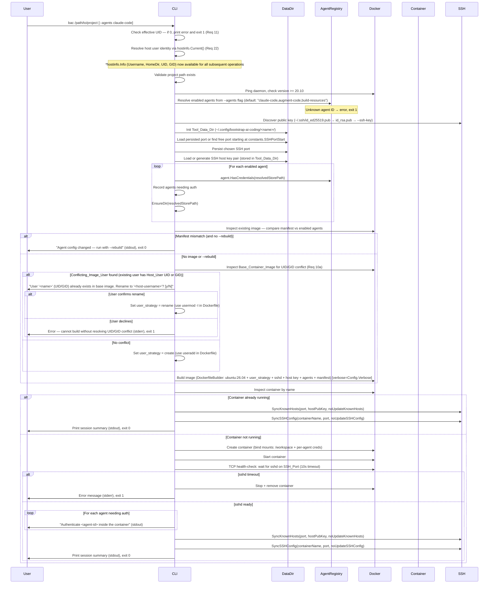
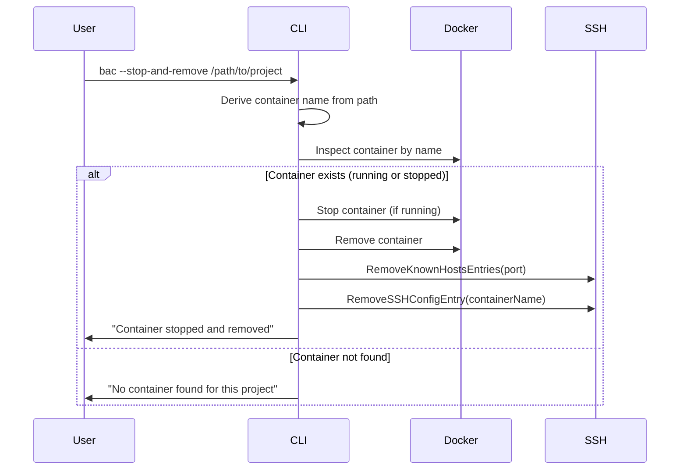
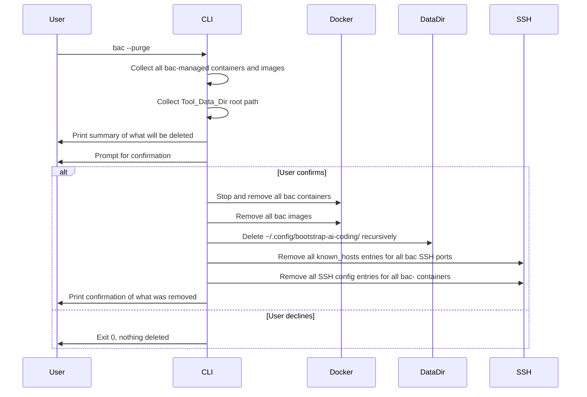

# Part 1 — Core Application Design

## Architecture

### High-Level Component Diagram


The core packages (`internal/cmd`, `internal/naming`, `internal/docker`, `internal/ssh`, `internal/datadir`, `internal/agent`) have **no import dependency** on any package under `internal/agents/`. Agent modules are wired in exclusively via `main.go` blank imports.

> **Note (Module Consolidation):** The former `internal/credentials` and `internal/portfinder` packages have been merged into `internal/datadir`. Both dealt with per-project persistent state (credential paths, port selection/persistence) and had only `cmd/root.go` as their consumer. Consolidating them reduces package count without introducing import cycles or mixing unrelated concerns.

### Package Layout

```
bootstrap-ai-coding/
├── main.go                  # Blank-imports agent modules; wires everything together
│
└── internal/
    │   ── CORE ─────────────────────────────────────────────────────────────
    ├── constants/
    │   └── constants.go         # All glossary-derived constants — single source of truth
    ├── hostinfo/
    │   └── hostinfo.go          # Info struct + Current() — runtime host user identity (Req 22)
    ├── cmd/
    │   └── root.go              # Cobra root command, flag definitions, orchestration
    ├── naming/
    │   └── naming.go            # Deterministic container name from project path
    ├── docker/
    │   ├── client.go            # Docker SDK client wrapper; prerequisite checks (daemon reachable, version >= constants.MinDockerVersion)
    │   ├── builder.go           # DockerfileBuilder — dynamic Dockerfile assembly
    │   └── runner.go            # Container create/start/stop/inspect helpers
    ├── ssh/
    │   ├── keys.go              # Public key discovery
    │   ├── known_hosts.go       # ~/.ssh/known_hosts sync (SyncKnownHosts, RemoveKnownHostsEntries)
    │   └── ssh_config.go        # ~/.ssh/config sync (SyncSSHConfig, RemoveSSHConfigEntry, RemoveAllBACSSHConfigEntries)
    ├── datadir/
    │   ├── datadir.go           # Tool_Data_Dir management: create, read/write port, keys, manifest, purge
    │   ├── credentials.go       # Credential store path resolution and dir creation (merged from credentials/)
    │   └── portfinder.go        # SSH port auto-selection starting at constants.SSHPortStart (merged from portfinder/)
    ├── agent/
    │   ├── agent.go             # Agent interface definition  ← stable API boundary
    │   ├── preparer.go          # CredentialPreparer optional interface
    │   └── registry.go          # AgentRegistry — Register/Lookup/All
    │
    │   ── AGENT MODULES ────────────────────────────────────────────────────
    └── agents/
        ├── claude/
        │   └── claude.go        # Claude Code — reference Agent implementation
        ├── augment/
        │   └── augment.go       # Augment Code agent module
        └── buildresources/
            └── buildresources.go # Build Resources — pseudo-agent for dev toolchains
        # future agents added here, no core files change
```

### Startup Sequence



### Stop Sequence



### Purge Sequence



---

## Related Documents

The detailed designs that were previously in this file have been split into focused documents:

| File | Contents |
|---|---|
| [design-components.md](design-components.md) | Core component designs: Constants, HostInfo, Agent Interface, AgentRegistry, DockerfileBuilder, Headless Keyring, Git Config Forwarding, Restart Policy, Base Image Inspection, Verbose Mode, Naming, SSH Key Discovery, SSH known_hosts, SSH Config, Credentials, DataDir, PortFinder |
| [design-docker.md](design-docker.md) | Two-layer Docker image architecture (TL-1 through TL-11): motivation, layer split, builder changes, build flow, cache detection, rebuild/stop/purge behaviour |
| [design-data-models.md](design-data-models.md) | Core data models (Mode, Config, ContainerSpec, Mount, SessionSummary), error handling tables, integration test infrastructure |
| [design-build-resources.md](design-build-resources.md) | Build Resources agent module: implementation, design decisions, RunAsUser extension, Dockerfile layer order |
| [design-agents.md](design-agents.md) | Agent modules: contract, Claude Code implementation, adding future agents |
| [design-properties.md](design-properties.md) | Correctness properties (Properties 1–51) and full testing strategy |
