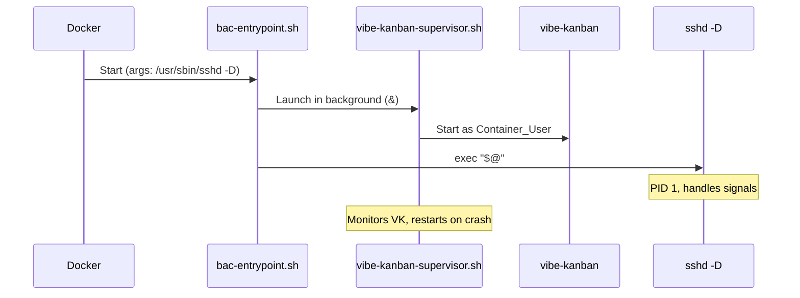

# Vibe Kanban Agent Module Design

This document describes the Vibe Kanban agent module, a web-based project management tool that runs as a background service inside the container.

> **Related documents:**
> - [design.md](design.md) - Overview and document index
> - [design-architecture.md](design-architecture.md) - High-level architecture
> - [design-agents.md](design-agents.md) - Agent modules: contract, implementations
> - [design-build-resources.md](design-build-resources.md) - Build Resources agent module
> - [requirements-agents.md](requirements-agents.md) - VK-1 through VK-8

---

## Overview

Vibe Kanban is a web-based kanban board for AI coding agents, distributed as the `vibe-kanban` npm package. Unlike other agent modules (which are CLI tools invoked on demand), Vibe Kanban is a **web application** that must be running as a background service after container start so the user can access it from their host browser.

The key design challenges are:
1. Auto-starting the service without replacing the container CMD (`/usr/sbin/sshd -D`)
2. Crash recovery with backoff to prevent resource exhaustion
3. Discovering the auto-assigned port for the session summary
4. Running as the Container_User (not root)

**Package:** `internal/agents/vibekanban/vibekanban.go`

**Validates: VK-1 through VK-8**

---

## Architecture

### Auto-Start Mechanism: ENTRYPOINT Wrapper Script

The container CMD is `["/usr/sbin/sshd", "-D"]`, set by `Finalize()` on the instance builder. Agent `Install()` methods run on the **base image builder** and cannot modify CMD. However, Docker's ENTRYPOINT + CMD interaction provides the solution:

- When both ENTRYPOINT and CMD are set, Docker executes: `ENTRYPOINT <CMD args...>`
- The agent installs a wrapper script at `/usr/local/bin/bac-entrypoint.sh` and sets `ENTRYPOINT ["/usr/local/bin/bac-entrypoint.sh"]`
- The wrapper starts background services, then exec's `"$@"` (which receives `/usr/sbin/sshd -D` from CMD)

This is the standard Docker pattern for initialization before the main process. It does NOT modify CMD - it adds ENTRYPOINT.



### Crash Recovery: Supervisor Script

The supervisor script (`/usr/local/bin/vibe-kanban-supervisor.sh`) implements crash recovery with backoff:

- Runs in an infinite loop, starting `vibe-kanban` each iteration
- Tracks restart timestamps in an array
- Before each restart, checks if 5 restarts have occurred in the last 60 seconds
- If the limit is hit, logs an error and exits (preventing resource exhaustion)
- Sleeps 5 seconds between restart attempts
- Runs the vibe-kanban process as the Container_User via `su -c`

### Port Discovery

Vibe Kanban auto-assigns its port at startup (VK-9.1). The supervisor script discovers the port and writes it to a well-known file:

1. The supervisor starts vibe-kanban in the background and captures its PID
2. It polls `ss -tlnp` filtered by the exact PID (`grep "pid=$VK_PID,"`) to find the bound port
3. Once found, it writes the port number to `/tmp/vibe-kanban.port`
4. `SummaryInfo()` reads this file (retrying up to 30 seconds)

This approach is robust because:
- It uses PID-based filtering (unambiguous, no process name dependency)
- It works regardless of how many other services bind ports in the container
- It avoids conflicts when multiple containers share the host network namespace (each gets a unique auto-assigned port)

See [design-agent-summary-info.md](design-agent-summary-info.md) for the `SummaryInfo()` implementation details.

### DockerfileBuilder Extension

The `DockerfileBuilder` needs a new `Entrypoint()` method:

```go
// Entrypoint appends an ENTRYPOINT instruction in exec form.
func (b *DockerfileBuilder) Entrypoint(args ...string) {
    quoted := make([]string, len(args))
    for i, a := range args {
        quoted[i] = fmt.Sprintf("%q", a)
    }
    b.lines = append(b.lines, fmt.Sprintf("ENTRYPOINT [%s]", strings.Join(quoted, ", ")))
}
```

When `Finalize()` emits `CMD ["/usr/sbin/sshd", "-D"]`, Docker will execute:
`/usr/local/bin/bac-entrypoint.sh /usr/sbin/sshd -D`

---

## Components and Interfaces

### Constants Addition

```go
// In internal/constants/constants.go:

// VibeKanbanAgentName is the stable Agent_ID for the Vibe Kanban agent module.
// Corresponds to the Agent_ID glossary term for Vibe Kanban (VK-1).
VibeKanbanAgentName = "vibe-kanban"
```

The `DefaultAgents` constant must be updated to include `vibe-kanban`:

```go
DefaultAgents = ClaudeCodeAgentName + "," + AugmentCodeAgentName + "," + BuildResourcesAgentName + "," + VibeKanbanAgentName
```

### Agent Module Interface Implementation

| Method | Return Value |
|--------|-------------|
| `ID()` | `constants.VibeKanbanAgentName` ("vibe-kanban") |
| `Install(b)` | Appends Node.js (conditional), npm install, entrypoint + supervisor scripts |
| `CredentialStorePath()` | `""` (no credentials) |
| `ContainerMountPath(homeDir)` | `""` (no bind-mount) |
| `HasCredentials(storePath)` | `(true, nil)` always |
| `HealthCheck(ctx, c, containerID)` | Binary check + process running check with retries |

### Session Summary: Agent-Owned SummaryInfo Pattern

The session summary is **core-agnostic**. There is no Vibe Kanban–specific field on `SessionSummary`. Instead, every agent implements `SummaryInfo(ctx, c, containerID) ([]agent.KeyValue, error)` and the core renderer (`FormatSessionSummary`) displays whatever key-value pairs agents provide:

```go
type SessionSummary struct {
    DataDir       string
    ProjectDir    string
    SSHPort       int
    SSHConnect    string
    EnabledAgents []string
    AgentInfo     []agent.KeyValue // populated by calling SummaryInfo on each enabled agent
}
```

`FormatSessionSummary` iterates `AgentInfo` without knowledge of which agent produced which entry:

```go
func FormatSessionSummary(s SessionSummary) string {
    var sb strings.Builder
    fmt.Fprintf(&sb, "Data directory:  %s\n", s.DataDir)
    fmt.Fprintf(&sb, "Project directory: %s\n", s.ProjectDir)
    fmt.Fprintf(&sb, "SSH port:        %d\n", s.SSHPort)
    fmt.Fprintf(&sb, "SSH connect:     %s\n", s.SSHConnect)
    fmt.Fprintf(&sb, "Enabled agents:  %s\n", strings.Join(s.EnabledAgents, ", "))
    for _, kv := range s.AgentInfo {
        fmt.Fprintf(&sb, "%-17s%s\n", kv.Key+":", kv.Value)
    }
    return sb.String()
}
```

### Port Discovery: Agent-Side Responsibility

Port discovery is **not** performed by core code. The Vibe Kanban agent's `SummaryInfo()` implementation is responsible for discovering its own port. It reads the port file (`/tmp/vibe-kanban.port`) written by the supervisor script, retrying for up to 30 seconds. The generic `docker.ExecInContainerWithOutput` helper is used to read the file inside the container.

See [design-agent-summary-info.md](design-agent-summary-info.md) for the full `SummaryInfo()` contract and implementation details.

---

## Data Models

### Generated Scripts

**`/usr/local/bin/bac-entrypoint.sh`** (installed by Install()):
```bash
#!/bin/bash
set -e

# Start Vibe Kanban supervisor in background
/usr/local/bin/vibe-kanban-supervisor.sh &

# Execute the original CMD (sshd -D)
exec "$@"
```

**`/usr/local/bin/vibe-kanban-supervisor.sh`** (installed by Install()):
```bash
#!/bin/bash
# Vibe Kanban supervisor with crash recovery
# Max 5 restarts within any 60-second window, 5-second delay between attempts

MAX_RESTARTS=5
WINDOW_SECONDS=60
DELAY_SECONDS=5
RESTART_TIMES=()
USERNAME="__USERNAME__"

while true; do
    # Prune timestamps older than the window
    NOW=$(date +%s)
    PRUNED=()
    for ts in "${RESTART_TIMES[@]}"; do
        if (( NOW - ts < WINDOW_SECONDS )); then
            PRUNED+=("$ts")
        fi
    done
    RESTART_TIMES=("${PRUNED[@]}")

    # Check if we've exceeded the restart limit
    if (( ${#RESTART_TIMES[@]} >= MAX_RESTARTS )); then
        echo "vibe-kanban-supervisor: exceeded $MAX_RESTARTS restarts in ${WINDOW_SECONDS}s, giving up" >&2
        exit 1
    fi

    # Record this restart attempt
    RESTART_TIMES+=("$(date +%s)")

    # Start vibe-kanban as the container user
    su -c "vibe-kanban" "$USERNAME" || true

    # Wait before restarting
    sleep "$DELAY_SECONDS"
done
```

The `__USERNAME__` placeholder is replaced at image build time with the actual Container_User username from `b.Username()`.

---

## Implementation

```go
package vibekanban

import (
    "context"
    "fmt"
    "time"

    "github.com/koudis/bootstrap-ai-coding/internal/agent"
    "github.com/koudis/bootstrap-ai-coding/internal/constants"
    "github.com/koudis/bootstrap-ai-coding/internal/docker"
)

type vibeKanbanAgent struct{}

func init() {
    agent.Register(&vibeKanbanAgent{})
}

// ID returns the stable Agent_ID "vibe-kanban".
// Satisfies: VK-1
func (a *vibeKanbanAgent) ID() string {
    return constants.VibeKanbanAgentName
}

// Install appends Dockerfile RUN steps that install Node.js (if not already
// installed), the vibe-kanban npm package, and the auto-start mechanism.
// Satisfies: VK-2, VK-3
func (a *vibeKanbanAgent) Install(b *docker.DockerfileBuilder) {
    // 1. Node.js (conditional — skip if another agent already installed it)
    if !b.IsNodeInstalled() {
        b.Run("apt-get update && DEBIAN_FRONTEND=noninteractive apt-get install -y --no-install-recommends curl ca-certificates && rm -rf /var/lib/apt/lists/*")
        b.Run("curl -fsSL https://deb.nodesource.com/setup_22.x | bash - && DEBIAN_FRONTEND=noninteractive apt-get install -y nodejs && rm -rf /var/lib/apt/lists/*")
        b.MarkNodeInstalled()
    }

    // 2. Install vibe-kanban globally
    b.Run("npm install -g --no-fund --no-audit vibe-kanban")

    // 3. Install the supervisor script with crash recovery
    username := b.Username()
    supervisorScript := fmt.Sprintf(`#!/bin/bash
MAX_RESTARTS=5
WINDOW_SECONDS=60
DELAY_SECONDS=5
RESTART_TIMES=()
while true; do
    NOW=$(date +%%s)
    PRUNED=()
    for ts in "${RESTART_TIMES[@]}"; do
        if (( NOW - ts < WINDOW_SECONDS )); then
            PRUNED+=("$ts")
        fi
    done
    RESTART_TIMES=("${PRUNED[@]}")
    if (( ${#RESTART_TIMES[@]} >= MAX_RESTARTS )); then
        echo "vibe-kanban-supervisor: exceeded $MAX_RESTARTS restarts in ${WINDOW_SECONDS}s, giving up" >&2
        exit 1
    fi
    RESTART_TIMES+=("$(date +%%s)")
    su -c "vibe-kanban --host 0.0.0.0" "%s" || true
    sleep "$DELAY_SECONDS"
done`, username)

    b.Run(fmt.Sprintf("printf '%%s' '%s' > /usr/local/bin/vibe-kanban-supervisor.sh && chmod +x /usr/local/bin/vibe-kanban-supervisor.sh",
        supervisorScript))

    // 4. Install the entrypoint wrapper
    entrypoint := `#!/bin/bash
set -e
/usr/local/bin/vibe-kanban-supervisor.sh &
exec "$@"`

    b.Run(fmt.Sprintf("printf '%%s' '%s' > /usr/local/bin/bac-entrypoint.sh && chmod +x /usr/local/bin/bac-entrypoint.sh",
        entrypoint))

    // 5. Set ENTRYPOINT so the supervisor starts before sshd
    b.Entrypoint("/usr/local/bin/bac-entrypoint.sh")
}

// CredentialStorePath returns empty - no credentials to persist.
// Satisfies: VK-4
func (a *vibeKanbanAgent) CredentialStorePath() string {
    return ""
}

// ContainerMountPath returns empty - no bind-mount needed.
// Satisfies: VK-4
func (a *vibeKanbanAgent) ContainerMountPath(homeDir string) string {
    return ""
}

// HasCredentials always returns true - nothing to check.
// Satisfies: VK-4
func (a *vibeKanbanAgent) HasCredentials(storePath string) (bool, error) {
    return true, nil
}

// HealthCheck verifies that:
// 1. The vibe-kanban binary is present (vibe-kanban --version exits 0)
// 2. The vibe-kanban process is running (pgrep with retries)
// Satisfies: VK-5
func (a *vibeKanbanAgent) HealthCheck(ctx context.Context, c *docker.Client, containerID string) error {
    // Check 1: Binary presence
    exitCode, err := docker.ExecInContainer(ctx, c, containerID, []string{"vibe-kanban", "--version"})
    if err != nil {
        return fmt.Errorf("vibe-kanban health check failed (binary): %w", err)
    }
    if exitCode != 0 {
        return fmt.Errorf("vibe-kanban health check failed: 'vibe-kanban --version' exited with code %d", exitCode)
    }

    // Check 2: Process running (with retries)
    const maxRetries = 5
    const retryInterval = 2 * time.Second

    for attempt := 1; attempt <= maxRetries; attempt++ {
        exitCode, err = docker.ExecInContainer(ctx, c, containerID, []string{"pgrep", "-f", "vibe-kanban"})
        if err != nil {
            return fmt.Errorf("vibe-kanban health check failed (process check): %w", err)
        }
        if exitCode == 0 {
            return nil // Process is running
        }
        if attempt < maxRetries {
            select {
            case <-ctx.Done():
                return ctx.Err()
            case <-time.After(retryInterval):
            }
        }
    }

    return fmt.Errorf("vibe-kanban health check failed: process not running after %d attempts", maxRetries)
}
```

---

## Core Changes Required

### 1. `internal/constants/constants.go`

Add the constant and update `DefaultAgents`:

```go
// VibeKanbanAgentName is the stable Agent_ID for the Vibe Kanban agent module.
// Corresponds to the Agent_ID glossary term for Vibe Kanban (VK-1).
VibeKanbanAgentName = "vibe-kanban"

// Update DefaultAgents:
DefaultAgents = ClaudeCodeAgentName + "," + AugmentCodeAgentName + "," + BuildResourcesAgentName + "," + VibeKanbanAgentName
```

### 2. `internal/docker/builder.go`

Add the `Entrypoint()` method:

```go
// Entrypoint appends an ENTRYPOINT instruction in exec form.
// Used by agent modules that need to run initialization before the main CMD.
func (b *DockerfileBuilder) Entrypoint(args ...string) {
    quoted := make([]string, len(args))
    for i, a := range args {
        quoted[i] = fmt.Sprintf("%q", a)
    }
    b.lines = append(b.lines, fmt.Sprintf("ENTRYPOINT [%s]", strings.Join(quoted, ", ")))
}
```

### 3. `internal/docker/runner.go`

Add a helper to execute a command and capture stdout:

```go
// ExecInContainerWithOutput runs a command inside a running container and
// returns the exit code and stdout content.
func ExecInContainerWithOutput(ctx context.Context, c *Client, containerID string, cmd []string) (int, string, error) {
    execID, err := c.ContainerExecCreate(ctx, containerID, container.ExecOptions{
        Cmd:          cmd,
        AttachStdout: true,
        AttachStderr: true,
    })
    if err != nil {
        return -1, "", fmt.Errorf("creating exec: %w", err)
    }

    resp, err := c.ContainerExecAttach(ctx, execID.ID, container.ExecAttachOptions{})
    if err != nil {
        return -1, "", fmt.Errorf("attaching to exec: %w", err)
    }
    defer resp.Close()

    var stdout, stderr bytes.Buffer
    _, _ = stdcopy.StdCopy(&stdout, &stderr, resp.Reader)

    inspect, err := c.ContainerExecInspect(ctx, execID.ID)
    if err != nil {
        return -1, "", fmt.Errorf("inspecting exec: %w", err)
    }

    return inspect.ExitCode, stdout.String(), nil
}
```

### 4. `internal/cmd/root.go`

#### SessionSummary struct (core-agnostic):

```go
type SessionSummary struct {
    DataDir       string
    ProjectDir    string
    SSHPort       int
    SSHConnect    string
    EnabledAgents []string
    AgentInfo     []agent.KeyValue // populated by calling SummaryInfo on each enabled agent
}
```

#### FormatSessionSummary (core-agnostic renderer):

```go
func FormatSessionSummary(s SessionSummary) string {
    var sb strings.Builder
    fmt.Fprintf(&sb, "Data directory:  %s\n", s.DataDir)
    fmt.Fprintf(&sb, "Project directory: %s\n", s.ProjectDir)
    fmt.Fprintf(&sb, "SSH port:        %d\n", s.SSHPort)
    fmt.Fprintf(&sb, "SSH connect:     %s\n", s.SSHConnect)
    fmt.Fprintf(&sb, "Enabled agents:  %s\n", strings.Join(s.EnabledAgents, ", "))
    for _, kv := range s.AgentInfo {
        fmt.Fprintf(&sb, "%-17s%s\n", kv.Key+":", kv.Value)
    }
    return sb.String()
}
```

#### Agent summary collection in `runStart()`:

After health checks pass and before printing the session summary, `runStart()` calls `SummaryInfo()` on every enabled agent generically — no agent-specific branching:

```go
// Collect agent summary info.
var agentInfo []agent.KeyValue
for _, a := range enabledAgents {
    kvs, err := a.SummaryInfo(ctx, c, containerName)
    if err != nil {
        fmt.Fprintf(os.Stderr, "warning: %s summary info: %v\n", a.ID(), err)
        continue
    }
    agentInfo = append(agentInfo, kvs...)
}
```

The core has **no** `discoverVibeKanbanPort` function and does **not** check `constants.VibeKanbanAgentName`. Port discovery is entirely the agent's responsibility inside its `SummaryInfo()` implementation.

### 5. `main.go`

Add the blank import:

```go
import (
    "github.com/koudis/bootstrap-ai-coding/internal/cmd"

    _ "github.com/koudis/bootstrap-ai-coding/internal/agents/augment"
    _ "github.com/koudis/bootstrap-ai-coding/internal/agents/buildresources"
    _ "github.com/koudis/bootstrap-ai-coding/internal/agents/claude"
    _ "github.com/koudis/bootstrap-ai-coding/internal/agents/vibekanban"
)
```

---

## Design Decisions

### 1. ENTRYPOINT wrapper (not supervisord, not cron, not systemd)

**Why:** Docker containers with a fixed CMD have limited options for running background services. The ENTRYPOINT + CMD pattern is the idiomatic Docker solution:
- ENTRYPOINT runs initialization (starts background services)
- CMD provides the main process arguments
- `exec "$@"` in the entrypoint ensures sshd becomes PID 1 and receives signals correctly

**Rejected alternatives:**
- **supervisord**: Heavy dependency (Python-based), overkill for one background process, adds image size
- **systemd**: Not available in Docker containers (no systemd as PID 1)
- **cron @reboot**: Requires crond running, which isn't started by sshd
- **/etc/profile.d/**: Only runs on SSH login, not on container start (violates VK-3.1)
- **Custom CMD**: Violates the constraint that agents cannot modify CMD

### 2. Shell-based supervisor (not a Go binary)

**Why:** The supervisor is a simple bash script installed via Dockerfile RUN steps. This avoids:
- Compiling and copying a separate binary into the image
- Adding complexity to the build process
- The script is ~20 lines and trivially auditable

### 3. `su -c` for user switching (not sudo, not USER directive)

**Why:** The entrypoint runs as root (Docker default). The supervisor uses `su -c "vibe-kanban" "$USERNAME"` to drop privileges. This is simpler than sudo (no sudoers parsing) and works reliably in the container environment.

### 4. Port discovery via port file (not `ss` process name matching)

**Why:** Vibe Kanban auto-assigns its port at startup. The supervisor discovers the port using PID-based `ss` filtering and writes it to `/tmp/vibe-kanban.port`. The `SummaryInfo()` method reads this file. This is more reliable than parsing `ss` output in `SummaryInfo()` because: (a) the Rust binary name in `ss` output varies by platform/version, (b) other services may bind ports in the container, and (c) PID-based filtering in the supervisor is unambiguous since it knows the exact child PID.

### 5. 30-second timeout for port discovery

**Why:** Vibe Kanban needs time to start up (Node.js initialization, port binding). 30 seconds is generous but bounded. If it fails, `SummaryInfo()` returns an error, the core prints a warning, and the URL is omitted from the summary. The container is still usable for SSH and other agents.

### 6. Graceful degradation for port discovery failure

**Why (VK-8.4):** If `SummaryInfo()` times out, the core's generic error handling prints a warning and omits that agent's key-value pairs from the session summary. The user can still SSH into the container and discover the port manually. This prevents a flaky network or slow startup from blocking the entire workflow.

### 7. `HOST=0.0.0.0` environment variable for vibe-kanban

**Why:** The vibe-kanban Rust binary reads the `HOST` environment variable to determine its listen address (defaults to `127.0.0.1`). Setting `HOST=0.0.0.0` ensures the server accepts connections on all interfaces, which is required for host network mode accessibility. The `BROWSER=none` variable is also set to suppress the automatic browser-open attempt in the headless container environment.

### 8. Zero core coupling — agent-owned SummaryInfo pattern

The core (`cmd/root.go`) has **no** Vibe Kanban–specific code. It does not reference `constants.VibeKanbanAgentName` for port discovery or session summary rendering. Instead:

- Every agent implements `SummaryInfo(ctx, c, containerID) ([]agent.KeyValue, error)`.
- The core iterates all enabled agents, calls `SummaryInfo()`, and appends the returned key-value pairs to the session summary.
- Port discovery, URL formatting, and timeout logic live entirely inside the Vibe Kanban agent's `SummaryInfo()` method.
- The generic `docker.ExecInContainerWithOutput` helper is used by the agent to read the port file inside the container.

This satisfies VK-6.1 (no core coupling) without conflicting with VK-8.3 (session summary includes the URL), because the agent itself provides the URL through the generic interface.

---

## Error Handling

| Scenario | Behavior |
|----------|----------|
| Node.js already installed by another agent | Skip Node.js installation (check `b.IsNodeInstalled()`) |
| `npm install -g vibe-kanban` fails | Image build fails (standard Docker behavior) |
| Entrypoint script fails to start supervisor | sshd still starts (supervisor failure is non-fatal to exec "$@") |
| Vibe Kanban crashes | Supervisor restarts it (up to 5 times in 60s) |
| Supervisor gives up after max restarts | Logs error to stderr, exits; container continues running (sshd is PID 1) |
| Health check: binary not found | Returns error identifying "binary" check |
| Health check: process not running after 5 retries | Returns error identifying "process" check with retry count |
| `SummaryInfo()` port discovery times out (30s) | Core prints warning, URL omitted from summary, startup succeeds |
| `SummaryInfo()` exec fails | Core prints warning, URL omitted from summary, startup succeeds |
| `--host-network-off` (bridge mode) | URL still shown; accessibility depends on Docker port mapping (outside agent scope) |

---

## Testing Strategy

### Unit Tests (example-based)

| Test | What it verifies |
|------|-----------------|
| `TestID` | Returns `constants.VibeKanbanAgentName` |
| `TestInstallNodeAlreadyInstalled` | Skips Node.js when `IsNodeInstalled()` is true |
| `TestInstallNodeNotInstalled` | Installs Node.js when `IsNodeInstalled()` is false |
| `TestInstallContainsNpmPackage` | Output contains `npm install -g vibe-kanban` |
| `TestInstallContainsEntrypoint` | Output contains ENTRYPOINT instruction |
| `TestInstallContainsSupervisor` | Output contains supervisor script with crash recovery params |
| `TestInstallDoesNotContainCMD` | Output does NOT contain CMD instruction |
| `TestInstallNoRustNoPnpm` | Output does NOT contain rust/pnpm references |
| `TestCredentialStorePath` | Returns empty string |
| `TestContainerMountPath` | Returns empty string for various homeDir values |
| `TestHasCredentials` | Returns (true, nil) |
| `TestHealthCheckBinaryFailure` | Error message identifies binary check |
| `TestHealthCheckProcessFailure` | Error message identifies process check |
| `TestFormatSessionSummaryWithAgentInfo` | AgentInfo key-value pairs rendered when present |
| `TestFormatSessionSummaryWithoutAgentInfo` | No extra lines when AgentInfo is empty |

### Property-Based Tests

Property tests use `pgregory.net/rapid` with minimum 100 iterations.

See Correctness Properties section below.

### Integration Tests

| Test | What it verifies |
|------|-----------------|
| `TestVibeKanbanInstallsAndRuns` | Full image build, binary present, process running |
| `TestVibeKanbanHealthCheck` | Health check passes on a live container |
| `TestVibeKanbanPortDiscovery` | Port is discoverable via ss after startup |
| `TestVibeKanbanCrashRecovery` | Process restarts after being killed |
| `TestVibeKanbanAccessibleFromHost` | HTTP GET to localhost:port returns 2xx (host network mode) |

---

## Correctness Properties

*A property is a characteristic or behavior that should hold true across all valid executions of a system - essentially, a formal statement about what the system should do. Properties serve as the bridge between human-readable specifications and machine-verifiable correctness guarantees.*

### Property 1: Node.js conditional installation invariant

*For any* DockerfileBuilder state (whether `IsNodeInstalled()` returns true or false), calling `Install()` on the Vibe Kanban agent SHALL result in the generated Dockerfile containing at most one Node.js installation block, and `IsNodeInstalled()` SHALL return true after the call.

**Validates: Requirements VK-2.1**

### Property 2: Install does not emit CMD

*For any* DockerfileBuilder state, calling `Install()` on the Vibe Kanban agent SHALL NOT append any line starting with `CMD` to the builder output. The agent only sets ENTRYPOINT, never CMD.

**Validates: Requirements VK-3.1**

### Property 3: No-credential-store invariant

*For any* string value passed as `homeDir` to `ContainerMountPath()`, the return value SHALL be the empty string. *For any* string value passed as `storePath` to `HasCredentials()`, the return value SHALL be `(true, nil)`.

**Validates: Requirements VK-4.2, VK-4.3**

### Property 4: Session summary includes agent-provided key-value pairs for any valid content

*For any* non-empty `AgentInfo` slice containing `KeyValue{Key: "Vibe Kanban", Value: "http://localhost:<port>"}` where port is a valid TCP port (1-65535), `FormatSessionSummary()` SHALL include a line containing that URL. When `AgentInfo` is empty or nil, the output SHALL NOT contain any agent-specific lines beyond the standard fields.

**Validates: Requirements VK-8.3 (via the generic SummaryInfo pattern)**

### Property 5: Supervisor script contains correct backoff parameters

*For any* username string (non-empty, valid Linux username characters), the supervisor script generated by `Install()` SHALL contain the constants `MAX_RESTARTS=5`, `WINDOW_SECONDS=60`, and `DELAY_SECONDS=5`, ensuring the crash recovery backoff is correctly configured regardless of the container user.

**Validates: Requirements VK-3.5**

---

## Dockerfile Layer Order (with Vibe Kanban)

When all default agents are enabled, the Vibe Kanban layers appear in the base image:

**Base_Image (`bac-base:latest`):**
```
FROM ubuntu:26.04
RUN apt-get install openssh-server sudo          <- base
RUN useradd <username>                           <- stable per user
RUN sudoers                                      <- stable
RUN dbus-x11 gnome-keyring libsecret-1-0         <- keyring (CC-7)
RUN /etc/profile.d/dbus-keyring.sh               <- keyring startup
RUN gitconfig                                    <- git config (Req 24)
RUN curl ca-certificates git + nodejs            <- Claude/Augment shared deps
RUN npm install -g @anthropic-ai/claude-code     <- Claude Code
RUN npm install -g @augmentcode/auggie           <- Augment Code
RUN python3 cmake build-essential default-jdk    <- Build Resources (system)
RUN go tarball + /etc/profile.d/golang.sh        <- Build Resources (Go)
RUN uv install                                   <- Build Resources (uv)
RUN npm install -g vibe-kanban                   <- Vibe Kanban (binary)
RUN printf supervisor script                     <- Vibe Kanban (supervisor)
RUN printf entrypoint script                     <- Vibe Kanban (entrypoint)
ENTRYPOINT ["/usr/local/bin/bac-entrypoint.sh"]  <- Vibe Kanban (auto-start)
RUN echo manifest > /bac-manifest.json           <- manifest
```

**Instance_Image (`bac-<name>:latest`):**
```
FROM bac-base:latest
RUN SSH host key injection                       <- per-project
RUN SSH authorized_keys                          <- per-user key
RUN sshd_config hardening                        <- per-project
RUN mkdir /run/sshd                              <- stable
CMD ["/usr/sbin/sshd", "-D"]                     <- always last
```

Docker executes: `ENTRYPOINT CMD` = `/usr/local/bin/bac-entrypoint.sh /usr/sbin/sshd -D`

The entrypoint starts the supervisor in the background, then exec's sshd as PID 1.
