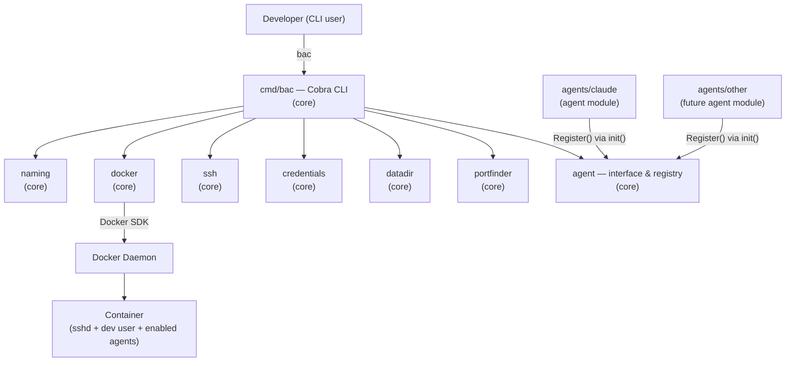
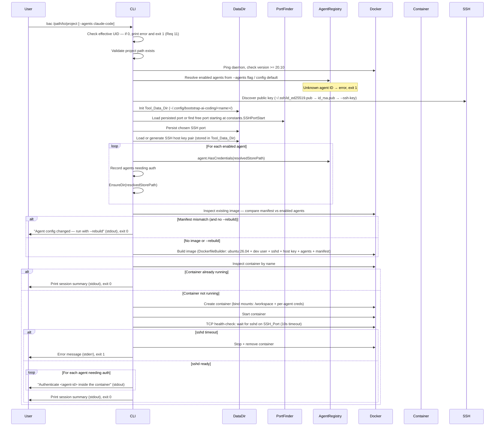
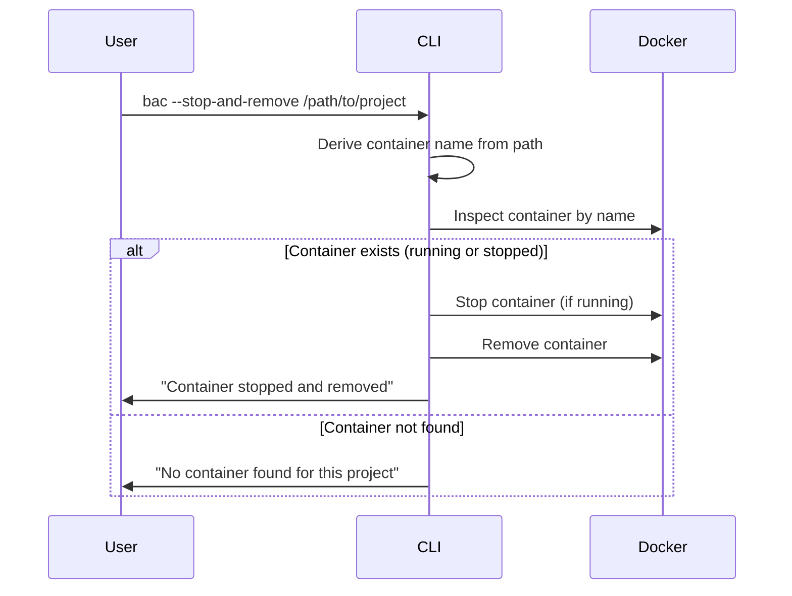
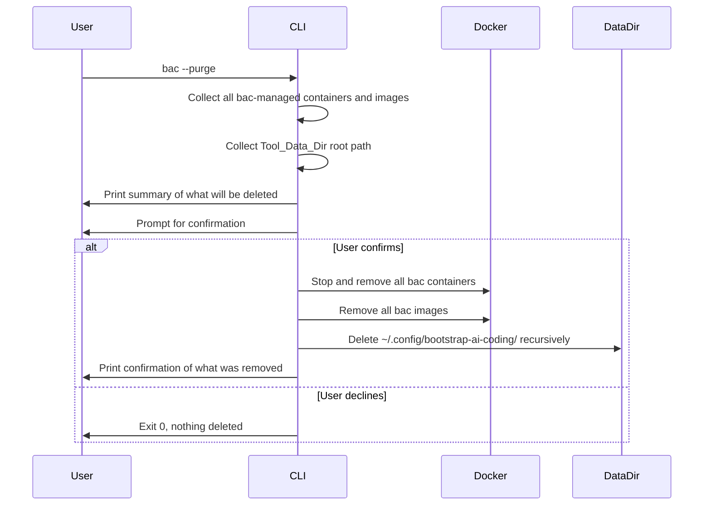

# Design Document: bootstrap-ai-coding

## Overview

`bootstrap-ai-coding` (bac) is a Go CLI tool that provisions an isolated Docker container for AI-assisted coding sessions. The user supplies a project path; the tool builds a container image on demand, mounts the project and per-agent credential stores, starts an SSH server, and prints the connection details.

The design is split to mirror the requirements split:

- **Part 1 — Core Application**: CLI orchestration, Docker lifecycle, SSH, volume mounts, and the Agent module API (`Agent` interface + `AgentRegistry`). The core contains zero agent-specific logic.
- **Part 2 — Agent Modules**: Self-contained Go packages that implement the `Agent` interface. Claude Code is the reference implementation. New agents are added here without touching core code.

### Key Design Goals

- **Zero-friction startup**: one command, one argument, ready to SSH in.
- **Pluggable agents**: the `Agent` interface and `AgentRegistry` decouple agent logic from the orchestration layer entirely.
- **Open/closed core**: adding a new agent requires only a new package in `agents/` — no core files change.
- **Reproducible containers**: deterministic naming and dynamic Dockerfile generation ensure consistent, idempotent behaviour.
- **Credential persistence**: per-agent bind-mounts keep authentication tokens alive across sessions.
- **Non-root safety**: the CLI refuses to run as root; containers run as a `dev` user whose UID/GID match the host user.
- **Stable SSH identity**: SSH host keys are generated once per project and reused across rebuilds, preventing `known_hosts` churn.
- **Persistent port assignment**: the SSH port is chosen once and remembered in the Tool_Data_Dir, so reconnecting is always the same command.

---

# Part 1 — Core Application Design

## Architecture

### High-Level Component Diagram



The core packages (`cmd`, `naming`, `docker`, `ssh`, `credentials`, `datadir`, `portfinder`, `agent`) have **no import dependency** on any package under `agents/`. Agent modules are wired in exclusively via `main.go` blank imports.

**Architectural rules:**
- All packages import glossary-derived constants from `constants/`. No package may hardcode values that appear in the glossary.

### Package Layout

```
bootstrap-ai-coding/
├── main.go                  # Blank-imports agent modules; wires everything together
│
│   ── CORE ──────────────────────────────────────────────────────────────────
├── constants/
│   └── constants.go         # All glossary-derived constants — single source of truth
├── cmd/
│   └── root.go              # Cobra root command, flag definitions, orchestration
├── naming/
│   └── naming.go            # Deterministic container name from project path
├── docker/
│   ├── client.go            # Docker SDK client wrapper; prerequisite checks (daemon reachable, version >= constants.MinDockerVersion)
│   ├── builder.go           # DockerfileBuilder — dynamic Dockerfile assembly
│   └── runner.go            # Container create/start/stop/inspect helpers
├── ssh/
│   └── keys.go              # Public key discovery
├── credentials/
│   └── store.go             # Credential store path resolution, dir creation, token check
├── datadir/
│   └── datadir.go           # Tool_Data_Dir management: create, read/write port, keys, manifest, purge
├── portfinder/
│   └── portfinder.go        # SSH port auto-selection: start at 2222, increment until free
├── agent/
│   ├── agent.go             # Agent interface definition  ← stable API boundary
│   └── registry.go          # AgentRegistry — Register/Lookup/All
│
│   ── AGENT MODULES ──────────────────────────────────────────────────────────
└── agents/
    └── claude/
        └── claude.go        # Claude Code — reference Agent implementation
    # future agents added here, no core files change
```

### Startup Sequence



### Stop Sequence



### Purge Sequence



---

## Core Components and Interfaces

### Constants Package — Single Source of Truth

`constants/constants.go` holds every value that originates from the requirements glossary. No other package may hardcode these values — they must always import and reference this package.

```go
// Package constants defines all project-wide constants derived from the
// requirements glossary. Every other package must import from here rather
// than hardcoding these values.
package constants

const (
    // Base_Container_Image — the base Docker image for all containers.
    BaseContainerImage = "ubuntu:26.04"

    // Container_User — the non-root username inside the container.
    ContainerUser = "dev"

    // Container_User_Home — the home directory of Container_User inside the container.
    // Derived as /home/<ContainerUser>.
    ContainerUserHome = "/home/" + ContainerUser

    // WorkspaceMountPath — the path inside the container where the project is mounted.
    // Corresponds to the Mounted_Volume glossary term.
    WorkspaceMountPath = "/workspace"

    // SSHPortStart — the starting port for SSH port auto-selection (SSH_Port glossary term).
    SSHPortStart = 2222

    // ToolDataDirRoot — the root directory for all tool-generated persistent data (Tool_Data_Dir).
    ToolDataDirRoot = "~/.config/bootstrap-ai-coding"

    // ContainerNamePrefix — the prefix for all deterministic container names.
    ContainerNamePrefix = "bac-"

    // ContainerNameHashLen — number of hex characters in the container name suffix.
    // Derived from the first ContainerNameHashLen/2 bytes of the SHA-256 hash.
    ContainerNameHashLen = 12

    // ManifestFilePath — the path inside the container image where the agent manifest is stored.
    ManifestFilePath = "/bac-manifest.json"

    // DefaultAgent — the agent ID used when --agents flag is omitted.
    DefaultAgent = "claude-code"

    // SSHHostKeyType — the SSH host key algorithm used for generated host keys.
    SSHHostKeyType = "ed25519"

    // MinDockerVersion — the minimum required Docker daemon version.
    MinDockerVersion = "20.10"

    // ContainerSSHPort — the port sshd listens on inside the container.
    ContainerSSHPort = 22

    // ToolDataDirPerm — directory permission for Tool_Data_Dir and subdirectories.
    ToolDataDirPerm = 0o700

    // ToolDataFilePerm — file permission for all files written to Tool_Data_Dir.
    ToolDataFilePerm = 0o600
)
```

Every package that previously hardcoded any of these values now imports `constants` instead:

```go
import "github.com/user/bootstrap-ai-coding/constants"

// Example usages:
b.From(constants.BaseContainerImage)                    // docker/builder.go
fmt.Sprintf("%s%x", constants.ContainerNamePrefix, ...) // naming/naming.go
for port := constants.SSHPortStart; ...                 // portfinder/portfinder.go
os.MkdirAll(constants.ToolDataDirRoot, constants.ToolDataDirPerm) // datadir/datadir.go
```

**Agent modules** may also import `constants` for `ContainerUserHome` — this is the one exception to the "agent modules only import `agent` and `docker`" rule, since `constants` has no dependencies and is pure data.

**Validates: All glossary-derived values across Req 1–17, CC-1–CC-6**

---

### Agent Interface — The Core API Boundary

The `Agent` interface is the **stable contract** between the core and all agent modules. It lives in `agent/agent.go` and is the only thing an agent module needs to implement. The core never imports any `agents/*` package directly.

```go
package agent

import (
    "context"

    "github.com/user/bootstrap-ai-coding/docker"
)

// Agent is the contract every AI coding agent module must satisfy.
// Implementations register themselves via agent.Register() in an init() function.
// The core orchestration layer interacts exclusively through this interface —
// it has no knowledge of any concrete agent type.
type Agent interface {
    // ID returns the unique, stable identifier for this agent (e.g. "claude-code").
    // This is the value users supply to --agents.
    ID() string

    // Install appends the agent's Dockerfile RUN steps to the provided builder.
    // The builder already contains the base ubuntu:26.04 layer, the dev user setup,
    // openssh-server, and the injected SSH host key.
    // The agent must not assume any other agent's steps have run.
    Install(b *docker.DockerfileBuilder)

    // CredentialStorePath returns the default path on the Host where this agent
    // stores its authentication tokens (e.g. "~/.claude").
    // The path may contain "~/" which the core will expand.
    CredentialStorePath() string

    // ContainerMountPath returns the absolute path inside the Container where
    // the agent expects its credential store to be mounted
    // (e.g. "/home/dev/.claude").
    ContainerMountPath() string

    // HasCredentials reports whether the credential store at storePath contains
    // existing authentication tokens for this agent.
    // Returns (false, nil) when the store is empty — not an error condition.
    HasCredentials(storePath string) (bool, error)

    // HealthCheck verifies that the agent is installed and ready to use inside
    // the running container identified by containerID.
    // Called by the core after the container starts successfully.
    HealthCheck(ctx context.Context, containerID string) error
}
```

**Validates: Req 7.1**

### AgentRegistry

The registry is a package-level map in `agent/registry.go`. Agent modules self-register in their `init()` functions. The core never calls any agent constructor directly.

```go
package agent

import "fmt"

var registry = map[string]Agent{}

// Register adds an agent to the global registry.
// Called from agent module init() functions.
// Panics on duplicate ID — this is a programming error caught at startup.
func Register(a Agent) {
    if _, exists := registry[a.ID()]; exists {
        panic(fmt.Sprintf("agent: duplicate registration for ID %q", a.ID()))
    }
    registry[a.ID()] = a
}

// Lookup returns the agent with the given ID, or a descriptive error if not found.
// The core calls this when resolving --agents flag values.
func Lookup(id string) (Agent, error) {
    a, ok := registry[id]
    if !ok {
        return nil, fmt.Errorf("agent %q is not registered; available agents: %v", id, KnownIDs())
    }
    return a, nil
}

// All returns all registered agents in an unspecified order.
func All() []Agent {
    agents := make([]Agent, 0, len(registry))
    for _, a := range registry {
        agents = append(agents, a)
    }
    return agents
}

// KnownIDs returns the IDs of all registered agents, sorted alphabetically.
func KnownIDs() []string { /* ... */ }
```

Agent modules are wired into the binary exclusively via blank imports in `main.go`:

```go
import (
    _ "github.com/user/bootstrap-ai-coding/agents/claude"
    // Add future agents here — no other file changes required
)
```

**Validates: Req 7.2**

### DockerfileBuilder

`docker/builder.go` is a core component. It assembles a Dockerfile incrementally. The base layer (`ubuntu:26.04` + `dev` user setup + sshd + SSH host key injection) is always present. Each enabled agent appends its own `RUN` steps by calling methods on the builder during `Install()`. A manifest `COPY` step is added last. The core never hard-codes any agent's install steps.

The builder accepts the host user's UID and GID (for `useradd`), the public key (for `authorized_keys`), and the SSH host key content (injected from Tool_Data_Dir) as constructor parameters.

```go
package docker

import (
    "bytes"
    "fmt"
    "strings"
)

// DockerfileBuilder assembles a Dockerfile incrementally.
type DockerfileBuilder struct {
    lines []string
}

// NewDockerfileBuilder returns a builder pre-seeded with:
//   - FROM constants.BaseContainerImage
//   - openssh-server + sudo installation
//   - dev user creation (UID/GID matching host user)
//   - passwordless sudo for dev
//   - SSH authorized_keys for dev
//   - SSH host key injection from Tool_Data_Dir
//   - sshd_config hardening (no password auth, no root login)
//   - CMD to start sshd
//
// uid and gid are the host user's effective UID/GID.
// publicKey is the content of the user's SSH public key.
// hostKeyPriv and hostKeyPub are the persisted SSH host key pair contents
// (key type is always constants.SSHHostKeyType).
func NewDockerfileBuilder(uid, gid int, publicKey, hostKeyPriv, hostKeyPub string) *DockerfileBuilder {
    b := &DockerfileBuilder{}
    b.From(constants.BaseContainerImage)
    b.Run("apt-get update && apt-get install -y --no-install-recommends openssh-server sudo && rm -rf /var/lib/apt/lists/*")
    // Create the Container_User group and user with matching UID/GID
    b.Run(fmt.Sprintf(
        `groupadd --gid %d %s && useradd --uid %d --gid %d --create-home --shell /bin/bash %s`,
        gid, constants.ContainerUser, uid, gid, constants.ContainerUser,
    ))
    // Passwordless sudo for Container_User
    b.Run(fmt.Sprintf(
        `echo '%s ALL=(ALL) NOPASSWD:ALL' >> /etc/sudoers.d/%s && chmod 0440 /etc/sudoers.d/%s`,
        constants.ContainerUser, constants.ContainerUser, constants.ContainerUser,
    ))
    // Install SSH public key for Container_User
    b.Run(fmt.Sprintf(
        `mkdir -p %s/.ssh && echo %%q >> %s/.ssh/authorized_keys && chmod 700 %s/.ssh && chmod 600 %s/.ssh/authorized_keys && chown -R %s:%s %s/.ssh`,
        constants.ContainerUserHome, constants.ContainerUserHome,
        constants.ContainerUserHome, constants.ContainerUserHome,
        constants.ContainerUser, constants.ContainerUser, constants.ContainerUserHome,
    ), publicKey)
    // Inject persisted SSH host key pair (constants.SSHHostKeyType = "ed25519")
    privPath := fmt.Sprintf("/etc/ssh/ssh_host_%s_key", constants.SSHHostKeyType)
    pubPath := privPath + ".pub"
    b.Run(fmt.Sprintf(
        `echo %%q > %s && echo %%q > %s && chmod 600 %s && chmod 644 %s`,
        privPath, pubPath, privPath, pubPath,
    ), hostKeyPriv, hostKeyPub)
    // Harden sshd_config
    b.Run(`echo 'PasswordAuthentication no' >> /etc/ssh/sshd_config && echo 'PermitRootLogin no' >> /etc/ssh/sshd_config && echo 'PubkeyAuthentication yes' >> /etc/ssh/sshd_config`)
    // Ensure sshd runtime dir exists
    b.Run(`mkdir -p /run/sshd`)
    b.Cmd(`/usr/sbin/sshd -D`)
    return b
}

func (b *DockerfileBuilder) From(image string)  { b.lines = append(b.lines, "FROM "+image) }
func (b *DockerfileBuilder) Run(cmd string)     { b.lines = append(b.lines, "RUN "+cmd) }
func (b *DockerfileBuilder) Env(k, v string)    { b.lines = append(b.lines, fmt.Sprintf("ENV %s=%s", k, v)) }
func (b *DockerfileBuilder) Copy(src, dst string) { b.lines = append(b.lines, fmt.Sprintf("COPY %s %s", src, dst)) }
func (b *DockerfileBuilder) Cmd(cmd string)     { b.lines = append(b.lines, fmt.Sprintf(`CMD ["/bin/sh", "-c", %q]`, cmd)) }

// Build returns the complete Dockerfile content as a string.
func (b *DockerfileBuilder) Build() string {
    return strings.Join(b.lines, "\n") + "\n"
}

// Lines returns a copy of the current instruction lines (used in tests).
func (b *DockerfileBuilder) Lines() []string {
    cp := make([]string, len(b.lines))
    copy(cp, b.lines)
    return cp
}
```

**Validates: Req 9.1–9.3, Req 10.1–10.5, Req 13.2**

### Naming Package

`naming/naming.go` derives a deterministic container name from the absolute project path.

```go
package naming

import (
    "crypto/sha256"
    "fmt"
    "path/filepath"

    "github.com/user/bootstrap-ai-coding/constants"
)

// ContainerName returns a deterministic Docker container name for the given
// project path. The name is constants.ContainerNamePrefix followed by the first
// constants.ContainerNameHashLen hex characters of the SHA-256 hash of the absolute path.
func ContainerName(projectPath string) (string, error) {
    abs, err := filepath.Abs(projectPath)
    if err != nil {
        return "", fmt.Errorf("resolving absolute path: %w", err)
    }
    sum := sha256.Sum256([]byte(abs))
    hexLen := constants.ContainerNameHashLen / 2 // bytes needed for hex chars
    return fmt.Sprintf("%s%x", constants.ContainerNamePrefix, sum[:hexLen]), nil
}
```

**Validates: Req 5.1**

### SSH Key Discovery

`ssh/keys.go` implements public key resolution with the precedence order from Req 4.1: `--ssh-key` flag > `~/.ssh/id_ed25519.pub` > `~/.ssh/id_rsa.pub`.

```go
package ssh

import (
    "errors"
    "os"
    "path/filepath"
)

// defaultKeyPaths lists candidate key files in precedence order (highest first).
var defaultKeyPaths = []string{
    "~/.ssh/id_ed25519.pub",
    "~/.ssh/id_rsa.pub",
}

// DiscoverPublicKey returns the contents of the first public key found.
// If sshKeyFlag is non-empty it is tried first (highest precedence).
func DiscoverPublicKey(sshKeyFlag string) (string, error) {
    candidates := defaultKeyPaths
    if sshKeyFlag != "" {
        candidates = append([]string{sshKeyFlag}, candidates...)
    }
    for _, p := range candidates {
        expanded := expandHome(p)
        data, err := os.ReadFile(expanded)
        if err == nil {
            return string(data), nil
        }
    }
    return "", errors.New("no SSH public key found; use --ssh-key to specify one")
}

func expandHome(p string) string {
    if len(p) >= 2 && p[:2] == "~/" {
        home, _ := os.UserHomeDir()
        return filepath.Join(home, p[2:])
    }
    return p
}
```

**Validates: Req 4.1, 4.4**

### Credentials Package

`credentials/store.go` handles per-agent credential store path resolution and directory creation. It is agent-agnostic — it operates on paths provided by the agent via the `Agent` interface.

```go
package credentials

import (
    "os"
    "path/filepath"

    "github.com/user/bootstrap-ai-coding/constants"
)

// Resolve returns the effective credential store path for an agent.
// If override is non-empty it takes precedence over the agent's default.
func Resolve(agentDefault, override string) string {
    if override != "" {
        return override
    }
    return expandHome(agentDefault)
}

// EnsureDir creates the directory at path if it does not already exist.
func EnsureDir(path string) error {
    return os.MkdirAll(path, constants.ToolDataDirPerm)
}

func expandHome(p string) string {
    if len(p) >= 2 && p[:2] == "~/" {
        home, _ := os.UserHomeDir()
        return filepath.Join(home, p[2:])
    }
    return p
}
```

**Validates: Req 8.3, 8.4**

### DataDir Package

`datadir/datadir.go` manages the Tool_Data_Dir (`~/.config/bootstrap-ai-coding/<container-name>/`). It is the single source of truth for all persistent per-project data: SSH port, SSH host key pair, and agent manifest.

```go
package datadir

import (
    "fmt"
    "os"
    "path/filepath"

    "github.com/user/bootstrap-ai-coding/constants"
)

// DataDir represents the Tool_Data_Dir for a single project.
type DataDir struct {
    path string // absolute path to the project's data directory
}

// New returns a DataDir for the given container name, creating the directory
// (and all parents) with constants.ToolDataDirPerm if it does not exist.
func New(containerName string) (*DataDir, error) {
    root := expandHome(constants.ToolDataDirRoot)
    p := filepath.Join(root, containerName)
    if err := os.MkdirAll(p, constants.ToolDataDirPerm); err != nil {
        return nil, fmt.Errorf("creating data dir %s: %w", p, err)
    }
    return &DataDir{path: p}, nil
}

// Path returns the absolute path to this project's data directory.
func (d *DataDir) Path() string { return d.path }

// ReadPort reads the persisted SSH port. Returns 0 if not yet persisted.
func (d *DataDir) ReadPort() (int, error) { /* ... */ }

// WritePort persists the SSH port with constants.ToolDataFilePerm.
func (d *DataDir) WritePort(port int) error { /* ... */ }

// ReadHostKey reads the persisted SSH host key pair (key type = constants.SSHHostKeyType).
// Returns ("", "", nil) if not yet generated.
func (d *DataDir) ReadHostKey() (priv, pub string, err error) { /* ... */ }

// WriteHostKey persists the SSH host key pair with constants.ToolDataFilePerm.
func (d *DataDir) WriteHostKey(priv, pub string) error { /* ... */ }

// ReadManifest reads the agent manifest. Returns nil if not present.
func (d *DataDir) ReadManifest() ([]string, error) { /* ... */ }

// WriteManifest persists the agent manifest with constants.ToolDataFilePerm.
func (d *DataDir) WriteManifest(agentIDs []string) error { /* ... */ }

// PurgeRoot removes the entire Tool_Data_Dir root and all its contents.
func PurgeRoot() error {
    return os.RemoveAll(expandHome(constants.ToolDataDirRoot))
}
```

**Validates: Req 12.2, 13.1, 13.4, 15.1–15.3**

### PortFinder Package

`portfinder/portfinder.go` implements SSH port auto-selection. It starts at port 2222 and increments by 1 until it finds a port that is not in use on the host.

```go
package portfinder

import (
    "fmt"
    "net"

    "github.com/user/bootstrap-ai-coding/constants"
)

// FindFreePort returns the first free TCP port on localhost starting at
// constants.SSHPortStart, incrementing by 1 until a free port is found.
// The caller is responsible for persisting the returned port.
func FindFreePort() (int, error) {
    for port := constants.SSHPortStart; port < 65535; port++ {
        if IsPortFree(port) {
            return port, nil
        }
    }
    return 0, fmt.Errorf("no free port found starting at %d", constants.SSHPortStart)
}

// IsPortFree reports whether the given TCP port is free on localhost.
func IsPortFree(port int) bool {
    ln, err := net.Listen("tcp", fmt.Sprintf("127.0.0.1:%d", port))
    if err != nil {
        return false
    }
    ln.Close()
    return true
}
```

**Validates: Req 12.1**

---

## Core Data Models

### Mode

Every invocation belongs to exactly one mode, determined by flag combination (see `requirements-cli-combinations.md`):

```go
// Mode represents the operating mode of a single CLI invocation.
// Determined by flag validation before any other processing.
type Mode int

const (
    ModeStart Mode = iota // ¬S ∧ ¬U — start or reconnect to a container
    ModeStop              // S ∧ ¬U  — stop and remove a container
    ModePurge             // U ∧ ¬S  — remove all tool data, containers, images
)

// ResolveMode derives the Mode from the parsed flags.
// Returns an error for any invalid combination (CLI-1 through CLI-3).
func ResolveMode(stopAndRemove, purge bool) (Mode, error) {
    switch {
    case stopAndRemove && purge:
        return 0, errors.New("--stop-and-remove and --purge are mutually exclusive")
    case stopAndRemove:
        return ModeStop, nil
    case purge:
        return ModePurge, nil
    default:
        return ModeStart, nil
    }
}
```

### Config

```go
// Config holds the resolved runtime configuration for a single invocation.
// Mode is always set first; other fields are only populated for the relevant mode.
type Config struct {
    Mode               Mode              // Resolved invocation mode (ModeStart / ModeStop / ModePurge)
    ProjectPath        string            // Absolute path to the project directory (START and STOP only)
    EnabledAgents      []string          // Agent IDs (START only; from --agents or default)
    SSHKeyPath         string            // Override for SSH public key path (START only; --ssh-key)
    SSHPort            int               // Override for SSH port (START only; --port); 0 = auto-select
    CredStoreOverrides map[string]string // Per-agent credential store overrides (START only)
    Rebuild            bool              // Force image rebuild (START only; --rebuild)
}
```

### ContainerSpec

```go
// ContainerSpec is the fully resolved specification for a container.
type ContainerSpec struct {
    Name        string            // Deterministic container name (bac-<12hex>)
    ImageTag    string            // Docker image tag (derived from container name)
    Dockerfile  string            // Complete Dockerfile content (assembled by DockerfileBuilder)
    Mounts      []Mount           // All bind mounts: /workspace + per-agent credential stores
    SSHPort     int               // Host-side TCP port mapped to container port 22
    Labels      map[string]string // Docker labels for identification
    HostUID     int               // Host user UID (passed as build arg for dev user)
    HostGID     int               // Host user GID (passed as build arg for dev user)
}

// Mount represents a single Docker bind mount.
type Mount struct {
    HostPath      string
    ContainerPath string
    ReadOnly      bool
}
```

### AgentCredentialStatus

```go
// AgentCredentialStatus records the credential state for a single enabled agent.
type AgentCredentialStatus struct {
    AgentID        string
    StorePath      string // Resolved host path
    HasCredentials bool
}
```

### SessionSummary

```go
// SessionSummary holds the fields printed to stdout after a successful start.
type SessionSummary struct {
    DataDir       string   // Tool_Data_Dir path for this project
    ProjectDir    string   // Project_Path
    SSHPort       int      // SSH_Port
    SSHConnect    string   // Full SSH connection command, e.g. "ssh -p 2222 constants.ContainerUser@localhost"
    EnabledAgents []string // Enabled agent identifiers
}
```

---

## Core Error Handling

### CLI Flag Combination Errors (validated before all other checks)

| Condition | Requirement | Behaviour |
|---|---|---|
| `--stop-and-remove` and `--purge` both set | CLI-1 | Descriptive error → stderr, exit 1 |
| START or STOP mode and `<project-path>` absent | CLI-2 | Usage message → stderr, exit 1 |
| PURGE mode and `<project-path>` provided | CLI-2 | Descriptive error → stderr, exit 1 |
| STOP or PURGE mode and any of `--agents`, `--port`, `--ssh-key`, `--rebuild` set | CLI-3 | Descriptive error naming the incompatible flag(s) → stderr, exit 1 |
| `--port` value outside 1024–65535 | CLI-5 | Descriptive error → stderr, exit 1 |
| `--agents` parses to empty list | CLI-6 | Descriptive error → stderr, exit 1 |
| `--agents` contains unknown agent ID | CLI-6 | Unknown ID + available IDs → stderr, exit 1 |

### Runtime Errors

| Failure Condition | Detection Point | Behaviour |
|---|---|---|
| CLI invoked as root (UID 0) | After flag validation | "Running as root is not permitted" → stderr, exit 1 |
| Project path missing | After flag validation | Descriptive error → stderr, exit 1 |
| No SSH public key found | SSH key discovery | Descriptive error → stderr, exit 1 |
| Docker daemon unreachable | Docker prerequisite check | "Start Docker" message → stderr, exit 1 |
| Docker version < `constants.MinDockerVersion` | Docker prerequisite check | Detected + required version → stderr, exit 1 |
| Duplicate agent registration | `agent.Register()` at startup | Panic (programming error, caught immediately) |
| Agent manifest mismatch | Image inspect on startup | "Run with --rebuild" message → stdout, exit 0 |
| Image build failure | Docker build | Build log → stderr, exit 1 |
| Container start failure | Docker start | Stop container, error → stderr, exit 1 |
| SSH health check timeout | Post-start TCP poll | Stop container, error → stderr, exit 1 |
| Persisted port in use by another process | Port check before start | Port conflict message → stderr, exit 1 |
| `--stop-and-remove`, container not found | Docker inspect | Informational message → stdout, exit 0 |
| Container already running | Docker inspect before create | Session summary → stdout, exit 0 |
| `--purge` user declines confirmation | Confirmation prompt | Exit 0, nothing deleted |

---

# Part 2 — Agent Module Design

## Agent Module Contract

An agent module is a Go package under `agents/`. It must:

1. Define a private struct that implements the `agent.Agent` interface.
2. Call `agent.Register()` in its `init()` function.
3. Import only `agent`, `docker`, and `constants` from the core — never `cmd`, `naming`, `ssh`, `credentials`, `datadir`, `portfinder`, or `docker/runner`.
4. Be wired into the binary via a blank import in `main.go`.

No other file in the repository needs to change when a new agent module is added.

## Claude Code Agent Module

**Package:** `agents/claude/claude.go`
**Agent ID:** `"claude-code"`
**Validates:** Agent Req CC-1 through CC-6

### Implementation

```go
package claude

import (
    "context"
    "os"
    "path/filepath"

    "github.com/user/bootstrap-ai-coding/agent"
    "github.com/user/bootstrap-ai-coding/constants"
    "github.com/user/bootstrap-ai-coding/docker"
)

const agentID = constants.DefaultAgent

type claudeAgent struct{}

// init registers the Claude Code agent with the core registry.
// The core has no direct reference to this type.
func init() {
    agent.Register(&claudeAgent{})
}

// ID returns the stable agent identifier. (CC-1)
func (c *claudeAgent) ID() string { return agentID }

// Install contributes Node.js LTS + Claude Code npm package install steps. (CC-2)
// These steps run as root during image build; the resulting binaries are on PATH
// for all users including the Container_User (constants.ContainerUser).
func (c *claudeAgent) Install(b *docker.DockerfileBuilder) {
    b.Run("apt-get update && apt-get install -y --no-install-recommends curl ca-certificates git && rm -rf /var/lib/apt/lists/*")
    b.Run("curl -fsSL https://deb.nodesource.com/setup_lts.x | bash - && apt-get install -y nodejs && rm -rf /var/lib/apt/lists/*")
    b.Run("npm install -g @anthropic-ai/claude-code")
}

// CredentialStorePath returns the default host-side credential directory. (CC-3)
func (c *claudeAgent) CredentialStorePath() string {
    home, _ := os.UserHomeDir()
    return filepath.Join(home, ".claude")
}

// ContainerMountPath returns where credentials are mounted inside the container. (CC-3)
// Uses constants.ContainerUserHome so the path is never hardcoded.
func (c *claudeAgent) ContainerMountPath() string {
    return filepath.Join(constants.ContainerUserHome, ".claude")
}

// HasCredentials checks for the presence of Claude Code auth tokens. (CC-4)
// Claude Code stores its auth token in ~/.claude/.credentials.json.
func (c *claudeAgent) HasCredentials(storePath string) (bool, error) {
    tokenFile := filepath.Join(storePath, ".credentials.json")
    _, err := os.Stat(tokenFile)
    if os.IsNotExist(err) {
        return false, nil
    }
    return err == nil, err
}

// HealthCheck verifies `claude --version` exits 0 inside the container. (CC-5)
func (c *claudeAgent) HealthCheck(ctx context.Context, containerID string) error {
    // Uses docker exec via the Docker SDK to run `claude --version` as the Container_User.
    // Returns nil on exit code 0, error otherwise.
    return execInContainer(ctx, containerID, []string{"claude", "--version"})
}
```

### Adding a Future Agent

To add a new agent (e.g. `agents/aider/aider.go`):

1. Create the package implementing `agent.Agent`.
2. Call `agent.Register(&aiderAgent{})` in `init()`.
3. Add `_ "github.com/user/bootstrap-ai-coding/agents/aider"` to `main.go`.
4. Add a section to `requirements-agents.md` documenting the new agent's requirements.

No other files change.

---

## Correctness Properties

*A property is a characteristic or behavior that should hold true across all valid executions of a system — essentially, a formal statement about what the system should do. Properties serve as the bridge between human-readable specifications and machine-verifiable correctness guarantees.*

Properties are grouped by the part of the system they validate.

### Core Properties

#### Property 1: Non-existent project paths always produce errors

*For any* string that does not correspond to an existing filesystem path, the CLI's path validation SHALL return a non-nil error with a non-empty message.

**Validates: Req 1.4**

---

#### Property 2: Project path always produces a constants.WorkspaceMountPath bind mount

*For any* valid absolute project path, the container spec SHALL contain exactly one bind mount with `ContainerPath == constants.WorkspaceMountPath` and `HostPath == projectPath`.

**Validates: Req 2.1, 2.2**

---

#### Property 3: Generated Dockerfile always uses constants.BaseContainerImage as base image

*For any* set of enabled agents (including empty), the Dockerfile produced by `DockerfileBuilder` SHALL have `FROM ` + `constants.BaseContainerImage` as its first instruction and SHALL NOT reference any other base image.

**Validates: Req 9.1, 9.2, 9.3**

---

#### Property 4: Generated Dockerfile always includes SSH server and Container_User

*For any* set of enabled agents (including empty), the Dockerfile produced by `DockerfileBuilder` SHALL contain a `RUN` instruction that installs `openssh-server`, a `RUN` instruction that creates the `constants.ContainerUser` user with the correct UID/GID, and a `CMD` that starts `sshd`.

**Validates: Req 3.1, 10.1**

---

#### Property 5: Container_User UID and GID always match the host user

*For any* host UID and GID values, the Dockerfile produced by `DockerfileBuilder` SHALL contain `useradd` arguments that set the `constants.ContainerUser` user's UID to the host UID and GID to the host GID.

**Validates: Req 10.2, 10.3, 10.5**

---

#### Property 6: Container_User always has passwordless sudo

*For any* Dockerfile produced by `DockerfileBuilder`, the content SHALL include a `sudoers` entry granting `constants.ContainerUser` passwordless `sudo` access.

**Validates: Req 10.4**

---

#### Property 7: sshd_config always disables password authentication

*For any* Dockerfile produced by `DockerfileBuilder`, the content SHALL include `PasswordAuthentication no`.

**Validates: Req 4.5**

---

#### Property 8: Public key is always injected into constants.ContainerUserHome/.ssh/authorized_keys

*For any* non-empty public key string, the Dockerfile SHALL contain a `RUN` instruction that appends that exact key to `constants.ContainerUserHome + "/.ssh/authorized_keys"`.

**Validates: Req 4.2**

---

#### Property 9: Public key discovery respects precedence order

*For any* combination of key files present (`id_ed25519.pub`, `id_rsa.pub`, custom `--ssh-key`), `DiscoverPublicKey` SHALL return the highest-precedence available key: `--ssh-key` > `id_ed25519.pub` > `id_rsa.pub`.

**Validates: Req 4.1**

---

#### Property 10: SSH host key is always injected into the Dockerfile

*For any* SSH host key pair content, the Dockerfile produced by `DockerfileBuilder` SHALL contain a `RUN` instruction that writes the private key to `/etc/ssh/ssh_host_ed25519_key` and the public key to `/etc/ssh/ssh_host_ed25519_key.pub`.

**Validates: Req 13.2**

---

#### Property 11: SSH host key is stable across rebuilds

*For any* project, once an SSH host key pair has been generated and stored in the Tool_Data_Dir, reading it back SHALL return the same key pair on every subsequent read.

**Validates: Req 13.3**

---

#### Property 12: Container naming is deterministic and collision-resistant

*For any* absolute project path, `ContainerName` SHALL always return the same name. *For any* two distinct absolute paths, `ContainerName` SHALL return distinct names.

**Validates: Req 5.1**

---

#### Property 13: Docker version comparison is correct

*For any* version string, the version checker SHALL accept it if and only if the parsed version is `>= 20.10.0`.

**Validates: Req 6.3**

---

#### Property 14: Credential store path resolution respects override precedence

*For any* agent default path and override string, `credentials.Resolve` SHALL return the override when non-empty, and the expanded agent default when the override is empty.

**Validates: Req 8.3**

---

#### Property 15: Credential store directory is always created before mounting

*For any* non-existent credential store path, `credentials.EnsureDir` SHALL create the directory (and all parents) before the container starts.

**Validates: Req 8.4**

---

#### Property 16: --agents flag parsing produces correct agent ID slices

*For any* comma-separated string of agent IDs (including single IDs, multiple IDs, IDs with surrounding whitespace), the flag parser SHALL produce a slice of exactly the trimmed, non-empty IDs in original order.

**Validates: Req 7.4**

---

#### Property 17: Dockerfile contains install steps for exactly the enabled agents

*For any* non-empty set of enabled agent IDs, the Dockerfile SHALL contain each enabled agent's `Install()` steps and SHALL NOT contain steps from agents not in the enabled set.

**Validates: Req 8.1, 8.2**

---

#### Property 18: Every enabled agent's credential store is bind-mounted

*For any* non-empty set of enabled agents, the container spec's mount list SHALL contain one bind mount per agent with `HostPath == resolvedCredStorePath` and `ContainerPath == agent.ContainerMountPath()`.

**Validates: Req 8.3**

---

#### Property 19: Auth warning is printed for every agent with empty credentials

*For any* set of enabled agents where a subset has empty credential stores, the CLI output SHALL contain one warning per agent in that subset, each identifying the agent by `ID()`.

**Validates: Req 8.5**

---

#### Property 20: Port finder returns the first free port at or above constants.SSHPortStart

*For any* set of occupied ports starting at `constants.SSHPortStart`, `portfinder.FindFreePort` SHALL return the lowest port number >= `constants.SSHPortStart` that is not in the occupied set.

**Validates: Req 12.1**

---

#### Property 21: Persisted port round-trips correctly

*For any* valid port number, writing it to the Tool_Data_Dir and reading it back SHALL return the same port number.

**Validates: Req 12.2**

---

#### Property 22: SSH port is always bound to the selected host port

*For any* valid port number, the container spec SHALL contain a port binding mapping container port `constants.ContainerSSHPort/tcp` to that host port.

**Validates: Req 12.4**

---

#### Property 23: Manifest is written for exactly the enabled agents

*For any* set of enabled agent IDs, the Dockerfile SHALL contain a step that writes `constants.ManifestFilePath` listing exactly those agent IDs.

**Validates: Req 14.2**

---

#### Property 24: Tool_Data_Dir is created with constants.ToolDataDirPerm permissions

*For any* non-existent Tool_Data_Dir path, `datadir.New` SHALL create the directory with permissions `constants.ToolDataDirPerm`.

**Validates: Req 15.2**

---

#### Property 25: Session summary always contains all required fields

*For any* valid session configuration, the session summary printed to stdout SHALL contain labelled lines for: data directory, project directory, SSH port, SSH connect command, and enabled agents.

**Validates: Req 17.1, 17.2, 17.3**

---

#### Property 26: Unknown agent IDs always produce errors

*For any* string not matching a registered agent ID, `AgentRegistry.Lookup` SHALL return a non-nil error.

**Validates: Req 7.3**

---

### CLI Flag Combination Properties

#### Property 32: S ∧ U is always rejected (CLI-1)

*For any* invocation where both `--stop-and-remove` and `--purge` are set, `ResolveMode` SHALL return a non-nil error.

**Validates: CLI-1**

---

#### Property 33: Mode is always exactly one of START, STOP, PURGE (CLI-1)

*For any* valid combination of `stopAndRemove` and `purge` booleans (excluding `true ∧ true`), `ResolveMode` SHALL return exactly one of `ModeStart`, `ModeStop`, or `ModePurge`.

**Validates: CLI-1**

---

#### Property 34: START-only flags in STOP or PURGE mode always produce errors (CLI-3)

*For any* invocation in STOP or PURGE mode where any of `--agents`, `--port`, `--ssh-key`, or `--rebuild` is set, the CLI SHALL return a non-nil error identifying the incompatible flag(s).

**Validates: CLI-3**

---

#### Property 35: --port is always within 1024–65535 when provided (CLI-5)

*For any* integer value of `--port`, the CLI SHALL accept it if and only if `1024 ≤ port ≤ 65535`.

**Validates: CLI-5**

---

#### Property 36: --agents always resolves to a non-empty list of known IDs (CLI-6)

*For any* comma-separated `--agents` string, the CLI SHALL reject it if the parsed list is empty or contains any ID not in the AgentRegistry.

**Validates: CLI-6**

---

### Agent Module Properties

#### Property 27: All registered agents satisfy the Agent interface

*For any* agent returned by `agent.All()`, the agent SHALL implement all six methods of the `Agent` interface: `ID()`, `Install()`, `CredentialStorePath()`, `ContainerMountPath()`, `HasCredentials()`, `HealthCheck()`.

**Validates: Req 7.1, Agent Req CC-1 through CC-5**

---

#### Property 28: Claude Code agent ID is stable

*For any* invocation, `claudeAgent.ID()` SHALL always return `constants.DefaultAgent` (`"claude-code"`).

**Validates: Agent Req CC-1**

---

#### Property 29: Claude Code credential presence check is consistent

*For any* directory path, `HasCredentials` SHALL return `true` if and only if `.credentials.json` exists in that directory.

**Validates: Agent Req CC-4**

---

#### Property 30: Claude Code container mount path is always constants.ContainerUserHome/.claude

*For any* invocation, `claudeAgent.ContainerMountPath()` SHALL always return `constants.ContainerUserHome + "/.claude"`.

**Validates: Agent Req CC-3**

---

#### Property 31: Claude Code Dockerfile steps include Node.js and claude-code package

*For any* `DockerfileBuilder`, after calling `claudeAgent.Install(b)`, the resulting Dockerfile SHALL contain `RUN` instructions that install Node.js and `@anthropic-ai/claude-code`.

**Validates: Agent Req CC-2**

## Testing Strategy

### Dual Testing Approach

Unit/property-based tests cover pure logic. Integration tests cover Docker interactions and are gated by a build tag (`//go:build integration`).

### Property-Based Testing

The chosen library is **[`pgregory.net/rapid`](https://github.com/flyingmutant/rapid)**. Each property test runs a minimum of **100 iterations**.

**Tag format:** `// Feature: bootstrap-ai-coding, Property N: <property text>`

#### Property Test Sketches

```go
// Feature: bootstrap-ai-coding, Property 12: Container naming is deterministic and collision-resistant
func TestContainerNameDeterminism(t *testing.T) {
    rapid.Check(t, func(t *rapid.T) {
        path := rapid.StringMatching(`/[a-z/]+`).Draw(t, "path")
        name1, _ := naming.ContainerName(path)
        name2, _ := naming.ContainerName(path)
        if name1 != name2 {
            t.Fatalf("non-deterministic: %q != %q for path %q", name1, name2, path)
        }
    })
}

// Feature: bootstrap-ai-coding, Property 12: Container naming is deterministic and collision-resistant
func TestContainerNameCollisionResistance(t *testing.T) {
    rapid.Check(t, func(t *rapid.T) {
        p1 := rapid.StringMatching(`/[a-z/]+`).Draw(t, "path1")
        p2 := rapid.StringMatching(`/[a-z/]+`).Draw(t, "path2")
        rapid.Assume(p1 != p2)
        n1, _ := naming.ContainerName(p1)
        n2, _ := naming.ContainerName(p2)
        if n1 == n2 {
            t.Fatalf("collision: paths %q and %q both map to %q", p1, p2, n1)
        }
    })
}

// Feature: bootstrap-ai-coding, Property 2: Project path always produces a constants.WorkspaceMountPath bind mount
func TestWorkspaceMountAlwaysPresent(t *testing.T) {
    rapid.Check(t, func(t *rapid.T) {
        path := rapid.StringMatching(`/[a-zA-Z0-9_/.-]+`).Draw(t, "path")
        spec := docker.BuildContainerSpec(path, nil, "")
        found := false
        for _, m := range spec.Mounts {
            if m.ContainerPath == constants.WorkspaceMountPath && m.HostPath == path {
                found = true
            }
        }
        if !found {
            t.Fatalf("no %s mount for path %q", constants.WorkspaceMountPath, path)
        }
    })
}

// Feature: bootstrap-ai-coding, Property 3: Generated Dockerfile always uses constants.BaseContainerImage as base image
func TestDockerfileBaseImage(t *testing.T) {
    rapid.Check(t, func(t *rapid.T) {
        uid := rapid.IntRange(1000, 65000).Draw(t, "uid")
        gid := rapid.IntRange(1000, 65000).Draw(t, "gid")
        pubKey := rapid.StringMatching(`ssh-ed25519 [A-Za-z0-9+/]+ test@host`).Draw(t, "pubKey")
        b := docker.NewDockerfileBuilder(uid, gid, pubKey, "priv-key", "pub-key")
        lines := b.Lines()
        want := "FROM " + constants.BaseContainerImage
        if lines[0] != want {
            t.Fatalf("first line is %q, want %q", lines[0], want)
        }
    })
}

// Feature: bootstrap-ai-coding, Property 5: Container_User UID and GID always match the host user
func TestDockerfileDevUserUID(t *testing.T) {
    rapid.Check(t, func(t *rapid.T) {
        uid := rapid.IntRange(1000, 65000).Draw(t, "uid")
        gid := rapid.IntRange(1000, 65000).Draw(t, "gid")
        b := docker.NewDockerfileBuilder(uid, gid, "ssh-rsa AAAA test@host", "priv", "pub")
        content := b.Build()
        if !strings.Contains(content, fmt.Sprintf("--uid %d", uid)) {
            t.Fatalf("Dockerfile missing --uid %d", uid)
        }
        if !strings.Contains(content, fmt.Sprintf("--gid %d", gid)) {
            t.Fatalf("Dockerfile missing --gid %d", gid)
        }
        if !strings.Contains(content, constants.ContainerUser) {
            t.Fatalf("Dockerfile missing container user %q", constants.ContainerUser)
        }
    })
}

// Feature: bootstrap-ai-coding, Property 17: Dockerfile contains install steps for exactly the enabled agents
func TestDockerfileContainsExactlyEnabledAgents(t *testing.T) {
    allAgents := agent.All()
    rapid.Check(t, func(t *rapid.T) {
        n := rapid.IntRange(1, len(allAgents)).Draw(t, "n")
        enabled := allAgents[:n]
        b := docker.NewDockerfileBuilder(1000, 1000, "ssh-rsa AAAA test@host", "priv", "pub")
        for _, a := range enabled {
            a.Install(b)
        }
        _ = b.Build()
        // Assert each enabled agent's marker RUN step is present
        // Assert disabled agents' marker RUN steps are absent
    })
}

// Feature: bootstrap-ai-coding, Property 13: Docker version comparison is correct
func TestDockerVersionComparison(t *testing.T) {
    rapid.Check(t, func(t *rapid.T) {
        major := rapid.IntRange(0, 30).Draw(t, "major")
        minor := rapid.IntRange(0, 20).Draw(t, "minor")
        patch := rapid.IntRange(0, 10).Draw(t, "patch")
        ver := fmt.Sprintf("%d.%d.%d", major, minor, patch)
        ok := docker.IsVersionCompatible(ver)
        expected := major > 20 || (major == 20 && minor >= 10)
        if ok != expected {
            t.Fatalf("version %q: got %v, want %v", ver, ok, expected)
        }
    })
}

// Feature: bootstrap-ai-coding, Property 16: --agents flag parsing produces correct agent ID slices
func TestAgentsFlagParsing(t *testing.T) {
    rapid.Check(t, func(t *rapid.T) {
        ids := rapid.SliceOfN(rapid.StringMatching(`[a-z][a-z0-9-]*`), 1, 5).Draw(t, "ids")
        input := strings.Join(ids, ",")
        parsed := cmd.ParseAgentsFlag(input)
        if !reflect.DeepEqual(parsed, ids) {
            t.Fatalf("parsed %v from %q, want %v", parsed, input, ids)
        }
    })
}

// Feature: bootstrap-ai-coding, Property 20: Port finder returns the first free port at or above constants.SSHPortStart
func TestPortFinderReturnsFirstFreePort(t *testing.T) {
    rapid.Check(t, func(t *rapid.T) {
        numOccupied := rapid.IntRange(0, 5).Draw(t, "numOccupied")
        listeners := make([]net.Listener, 0, numOccupied)
        for i := 0; i < numOccupied; i++ {
            ln, err := net.Listen("tcp", fmt.Sprintf("127.0.0.1:%d", constants.SSHPortStart+i))
            if err != nil {
                break
            }
            listeners = append(listeners, ln)
        }
        defer func() {
            for _, ln := range listeners {
                ln.Close()
            }
        }()
        port, err := portfinder.FindFreePort()
        require.NoError(t, err)
        require.GreaterOrEqual(t, port, constants.SSHPortStart)
        require.True(t, portfinder.IsPortFree(port))
    })
}

// Feature: bootstrap-ai-coding, Property 21: Persisted port round-trips correctly
func TestPortRoundTrip(t *testing.T) {
    rapid.Check(t, func(t *rapid.T) {
        port := rapid.IntRange(1024, 65535).Draw(t, "port")
        dir := t.TempDir()
        dd := &datadir.DataDir{} // test helper constructor
        dd.WritePort(port)
        got, err := dd.ReadPort()
        require.NoError(t, err)
        require.Equal(t, port, got)
    })
}

// Feature: bootstrap-ai-coding, Property 25: Session summary always contains all required fields
func TestSessionSummaryContainsAllFields(t *testing.T) {
    rapid.Check(t, func(t *rapid.T) {
        port := rapid.IntRange(1024, 65535).Draw(t, "port")
        projectDir := rapid.StringMatching(`/[a-z/]+`).Draw(t, "projectDir")
        agentIDs := rapid.SliceOfN(rapid.StringMatching(`[a-z][a-z0-9-]*`), 1, 3).Draw(t, "agentIDs")
        summary := cmd.FormatSessionSummary(cmd.SessionSummary{
            DataDir:       "/home/user/.config/bootstrap-ai-coding/bac-abc123",
            ProjectDir:    projectDir,
            SSHPort:       port,
            SSHConnect:    fmt.Sprintf("ssh -p %d %s@localhost", port, constants.ContainerUser),
            EnabledAgents: agentIDs,
        })
        require.Contains(t, summary, "Data directory:")
        require.Contains(t, summary, "Project directory:")
        require.Contains(t, summary, "SSH port:")
        require.Contains(t, summary, "SSH connect:")
        require.Contains(t, summary, "Enabled agents:")
    })
}

// Feature: bootstrap-ai-coding, Property 29: Claude Code credential presence check is consistent
func TestClaudeHasCredentials(t *testing.T) {
    rapid.Check(t, func(t *rapid.T) {
        dir := t.TempDir()
        hasFile := rapid.Bool().Draw(t, "hasFile")
        if hasFile {
            os.WriteFile(filepath.Join(dir, ".credentials.json"), []byte(`{}`), constants.ToolDataFilePerm)
        }
        a, _ := agent.Lookup(constants.DefaultAgent)
        got, err := a.HasCredentials(dir)
        require.NoError(t, err)
        require.Equal(t, hasFile, got)
    })
}
```

### Unit Tests (Example-Based)

| Test | Validates |
|---|---|
| `TestNoArgsShowsUsage` | Req 1.3 |
| `TestInvalidProjectPathError` | Req 1.4 |
| `TestNoPublicKeyError` | Req 4.4 |
| `TestDockerDaemonUnreachable` | Req 6.2 |
| `TestIncompatibleDockerVersion` | Req 6.4 |
| `TestExistingContainerReturnsSessionSummary` | Req 5.2 |
| `TestStopAndRemoveNonExistentContainer` | Req 5.4 |
| `TestUnknownAgentIDError` | Req 7.3 |
| `TestDefaultAgentsUsedWhenFlagOmitted` | Req 7.5 |
| `TestRootExecutionPrevented` | Req 11.1, 11.2, 11.3 |
| `TestSSHHostKeyGeneratedOnFirstBuild` | Req 13.1 |
| `TestSSHHostKeyFilePermissions` | Req 13.4 |
| `TestManifestMismatchInstructsRebuild` | Req 14.3 |
| `TestRebuildFlagForcesRebuild` | Req 14.4 |
| `TestPurgeConfirmationPrompt` | Req 16.5 |
| `TestPurgeDeclinedDoesNothing` | Req 16.5 |
| `TestStopAndPurgeTogetherRejected` | CLI-1 |
| `TestPurgeWithProjectPathRejected` | CLI-2 |
| `TestStopWithoutProjectPathRejected` | CLI-2 |
| `TestAgentsFlagWithStopRejected` | CLI-3 |
| `TestPortFlagWithPurgeRejected` | CLI-3 |
| `TestRebuildFlagWithStopRejected` | CLI-3 |
| `TestPortBelowRangeRejected` | CLI-5 |
| `TestPortAboveRangeRejected` | CLI-5 |
| `TestEmptyAgentsFlagRejected` | CLI-6 |
| `TestClaudeAgentRegistered` | Agent Req CC-1, CC-6 |
| `TestClaudeInstallStepsPresent` | Agent Req CC-2 |
| `TestClaudeCredentialPaths` | Agent Req CC-3 |
| `TestClaudeContainerMountPath` | Agent Req CC-3 |

### Integration Tests

Gated by `//go:build integration`. Require a running Docker daemon.

| Test | Validates |
|---|---|
| `TestContainerStartsAndSSHConnects` | Req 3.3, 4.3 |
| `TestWorkspaceMountLiveSync` | Req 2.3 |
| `TestFileOwnershipMatchesHostUser` | Req 10.6 |
| `TestCredentialVolumePersistedAcrossRestart` | Req 8.6 |
| `TestSSHPortPersistenceAcrossRestarts` | Req 12.2 |
| `TestSSHHostKeyStableAcrossRebuild` | Req 13.3 |
| `TestPurgeRemovesContainersAndImages` | Req 16.2, 16.4 |
| `TestClaudeAvailableInContainer` | Agent Req CC-2.3 |
| `TestClaudeHealthCheck` | Agent Req CC-5 |

### Test Coverage Targets

- Unit + property tests: ≥ 80% line coverage on `naming`, `ssh`, `credentials`, `datadir`, `portfinder`, `agent`, `docker/builder.go`, `agents/claude`
- Integration tests: full happy path + SSH health-check failure path + rebuild path
