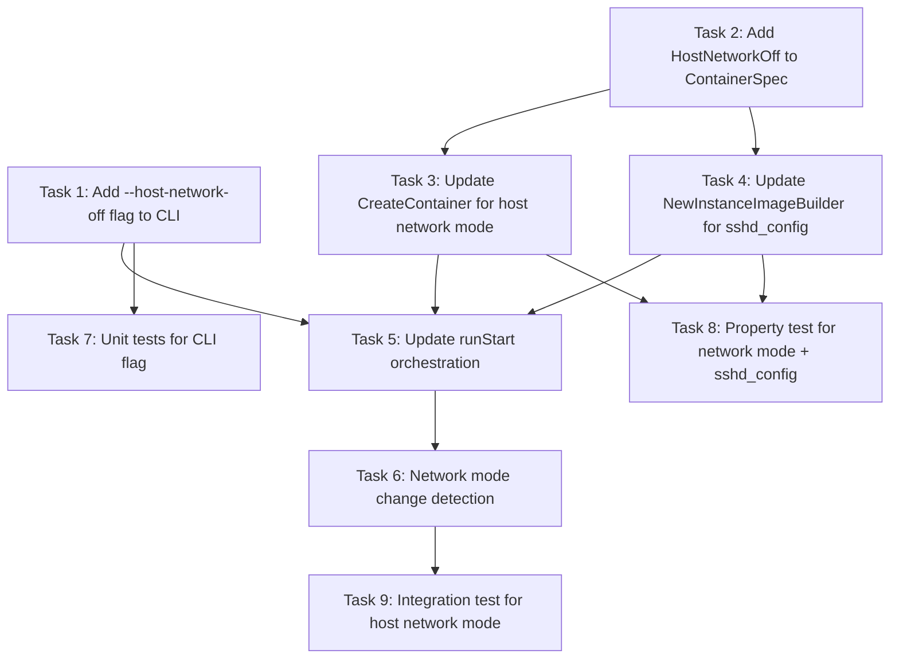

# Tasks: Host Network Mode (Req 26)

## Task Dependency Graph



---

## Task 1: Add `--host-network-off` flag to CLI

Add the `--host-network-off` boolean flag to `cmd/root.go`. Default is `false` (host network mode is ON). Register it as a START-only flag in `ValidateStartOnlyFlags`.

### Sub-tasks

- [x] 1.1. Add `flagHostNetworkOff bool` variable and register the flag in `init()`:
  ```go
  rootCmd.Flags().BoolVar(&flagHostNetworkOff, "host-network-off", false, "Disable host network mode; use bridge networking with port mapping")
  ```
- [x] 1.2. Add `"host-network-off": true` to the `startOnly` map in `ValidateStartOnlyFlags`.
- [x] 1.3. Thread `flagHostNetworkOff` into the `runStart` call (pass it as a parameter or add to a config struct).

---

## Task 2: Add `HostNetworkOff` field to `ContainerSpec`

Add the `HostNetworkOff bool` field to the `ContainerSpec` struct in `docker/runner.go`.

### Sub-tasks

- [x] 2.1. Add `HostNetworkOff bool` field to `ContainerSpec` struct with comment: `// Req 26: when true, use bridge mode; when false (default), use host network`.
- [x] 2.2. Update the `SSHPort` field comment from "Host-side TCP port mapped to container port 22" to "SSH port (used in sshd_config for host mode, or Docker port mapping for bridge mode)".

---

## Task 3: Update `CreateContainer` for host network mode

Modify `CreateContainer` in `docker/runner.go` to conditionally use `NetworkMode: "host"` (no port bindings) or bridge mode (with port bindings) based on `spec.HostNetworkOff`.

### Sub-tasks

- [x] 3.1. When `spec.HostNetworkOff == false` (default, host network mode):
  - Set `HostConfig.NetworkMode = "host"`
  - Do NOT set `PortBindings` or `ExposedPorts`
  - Do NOT set `ExposedPorts` in `container.Config`
- [x] 3.2. When `spec.HostNetworkOff == true` (bridge mode):
  - Keep existing port binding logic: map `constants.ContainerSSHPort/tcp` → `constants.HostBindIP:spec.SSHPort`
  - Set `ExposedPorts` in `container.Config`
  - Do NOT set `NetworkMode` (use Docker default bridge)
- [x] 3.3. Remove the `nat` import if it becomes conditionally unused (it won't — bridge mode still uses it).

---

## Task 4: Update `NewInstanceImageBuilder` for sshd_config

Modify `NewInstanceImageBuilder` in `docker/builder.go` to accept a `hostNetworkOff bool` parameter. When `false` (host mode), append `Port <sshPort>` and `ListenAddress 127.0.0.1` to sshd_config. When `true` (bridge mode), omit these directives.

### Sub-tasks

- [x] 4.1. Add `sshPort int` and `hostNetworkOff bool` parameters to `NewInstanceImageBuilder` signature.
- [x] 4.2. In step 4 (sshd_config hardening), conditionally append `Port` and `ListenAddress`:
  ```go
  sshdConfig := "echo 'PasswordAuthentication no' >> /etc/ssh/sshd_config && echo 'PermitRootLogin no' >> /etc/ssh/sshd_config && echo 'PubkeyAuthentication yes' >> /etc/ssh/sshd_config"
  if !hostNetworkOff {
      sshdConfig += fmt.Sprintf(" && echo 'Port %d' >> /etc/ssh/sshd_config && echo 'ListenAddress %s' >> /etc/ssh/sshd_config", sshPort, constants.HostBindIP)
  }
  b.Run(sshdConfig)
  ```
- [x] 4.3. Update all callers of `NewInstanceImageBuilder` to pass the new parameters (currently only `runStart` in `cmd/root.go`).

---

## Task 5: Update `runStart` orchestration

Wire the `--host-network-off` flag through the `runStart` function: pass it to `NewInstanceImageBuilder` and set it on the `ContainerSpec`.

### Sub-tasks

- [x] 5.1. Pass `flagHostNetworkOff` to `NewInstanceImageBuilder(info, publicKey, hostKeyPriv, hostKeyPub, sshPort, flagHostNetworkOff)`.
- [x] 5.2. Set `HostNetworkOff: flagHostNetworkOff` on the `ContainerSpec` passed to `CreateContainer`.
- [x] 5.3. Persist the `hostNetworkOff` value in the Tool_Data_Dir (for change detection in Task 6). Add `WriteHostNetworkOff` / `ReadHostNetworkOff` methods to `datadir.DataDir`.

---

## Task 6: Network mode change detection

Detect when `--host-network-off` changes between invocations and require `--rebuild`. This prevents running a container whose sshd_config doesn't match the network mode.

### Sub-tasks

- [x] 6.1. Add `datadir.WriteHostNetworkOff(off bool)` and `datadir.ReadHostNetworkOff() (bool, error)` — store as `"true"` or `"false"` in a file `host_network_off` in the Tool_Data_Dir.
- [x] 6.2. In `runStart`, after loading the persisted value, compare with the current `flagHostNetworkOff`. If they differ and `--rebuild` is not set, print "Network mode changed — run with --rebuild to update the image." and return nil (exit 0).
- [x] 6.3. When building the instance image (needInstance == true), persist the current `flagHostNetworkOff` value via `dd.WriteHostNetworkOff(flagHostNetworkOff)`.

---

## Task 7: Unit tests for CLI flag

Add unit tests for the `--host-network-off` flag validation and CLI-3 constraint.

### Sub-tasks

- [x] 7.1. In `cmd/root_test.go`, add test: `--host-network-off` with `--stop-and-remove` → error (CLI-3).
- [x] 7.2. In `cmd/root_test.go`, add test: `--host-network-off` with `--purge` → error (CLI-3).
- [x] 7.3. In `cmd/root_test.go`, add test: `--host-network-off` in START mode → accepted (no error from flag validation).

---

## Task 8: Property test for network mode + sshd_config (Property 22b, 57)

Add property-based tests validating that the Instance_Image Dockerfile and ContainerSpec are correct for both network modes.

### Sub-tasks

- [x] 8.1. In `docker/builder_test.go`, add PBT:
  ```go
  // Feature: bootstrap-ai-coding, Property 57: --host-network-off controls network mode and sshd_config
  func TestInstanceImageSSHDConfigHostNetwork(t *testing.T) {
      rapid.Check(t, func(t *rapid.T) {
          port := rapid.IntRange(1024, 65535).Draw(t, "port")
          hostNetworkOff := rapid.Bool().Draw(t, "hostNetworkOff")
          // Build instance image
          // Assert: if !hostNetworkOff → contains "Port <port>" and "ListenAddress 127.0.0.1"
          // Assert: if hostNetworkOff → does NOT contain "Port" or "ListenAddress"
      })
  }
  ```
- [x] 8.2. In `docker/runner_restart_test.go` (or a new `runner_network_test.go`), add a unit test verifying `CreateContainer` sets `NetworkMode: "host"` when `HostNetworkOff == false` and uses port bindings when `HostNetworkOff == true`. (This requires mocking the Docker client — follow existing patterns in `runner_restart_test.go`.)

---

## Task 9: Integration test for host network mode

Add an integration test that verifies end-to-end: container starts with host network, sshd is reachable on the assigned port, and a service on the host is reachable from inside the container.

### Sub-tasks

- [x] 9.1. In `docker/integration_test.go`, add test `TestHostNetworkModeSSHReachable`:
  - Build base + instance image with host network mode (hostNetworkOff=false)
  - Create and start container
  - Assert: `WaitForSSH(ctx, "127.0.0.1", sshPort, 10s)` succeeds
  - Cleanup: stop and remove container
- [x] 9.2. In `docker/integration_test.go`, add test `TestBridgeModeSSHReachable`:
  - Build base + instance image with bridge mode (hostNetworkOff=true)
  - Create and start container
  - Assert: `WaitForSSH(ctx, "127.0.0.1", sshPort, 10s)` succeeds
  - Cleanup: stop and remove container
- [x] 9.3. (Optional) Add test `TestHostNetworkCanReachHostService`:
  - Start a TCP listener on a random port on the host
  - Start container in host network mode
  - Exec `nc -z 127.0.0.1 <port>` inside the container
  - Assert: exit code 0 (service reachable)
